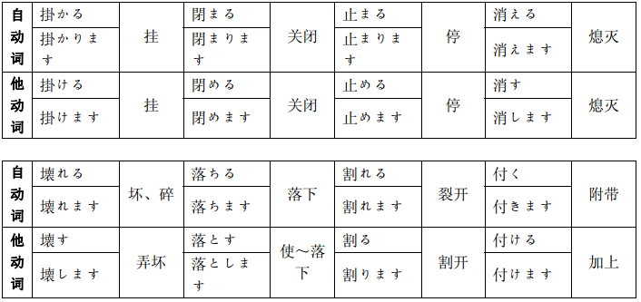
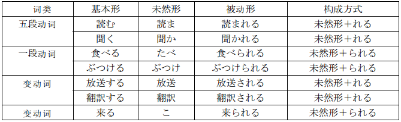
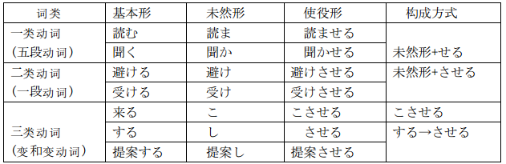

### 第25课

&emsp;&emsp;1. `动[简体形] + 名`：使用`动词小句`修饰名词时，需要动词的简体形。<!--more-->

1. 表示某种习惯或将要发生的动作时，用动词的`基本形`。
2. 表示动作已经完成时，用动词的`た形`。

- `これは明日会議で使う資料です`(这是明天会议要用的资料)
- `あれは森さんが今夜泊まるホテルです`(那是今晚森先生要入住的宾馆)
- `あれは倒産した会社です`(那是一家倒闭的公司)

&emsp;&emsp;注意，名词前不用敬体形。

- `さっき森さんが座りました + 場所` = `さっき森さんが座った場所`(森先生刚才坐过的地方)
- `森さんが知りません + ニュース` = `森さんが知らないニュース`(森先生不知道的新闻)

&emsp;&emsp;注意，名词前不能加`の`。

- `森さんが座る場所`(森先生要坐的地方)
- `あれはゆうべ泊まったホテルです`(那是昨天晚上住的宾馆)

&emsp;&emsp;2. `小句(动简体) + 名は + 名/形です`：动词小句修饰名词而形成的名词短语，常常用来做主语。

- `わたしが明日乗る飛行機は中国航空です`(我明天乘坐的飞机是中国航空公司的)
- `小野さんが作る料理はおいしいです`(小野女士做的菜很好吃)
- `森さんが買った本はこれです`(森先生买的书是这一本)

&emsp;&emsp;3. `小句(动简体) + 名を/に/から 动ます`：动词小句修饰名词而形成的名词短语，也可以用做主语以外的其他句子成分。

- `中国で買ったCDを友達に貸しました`(我把在中国买的`CD`借给朋友了)
- `中国へ転勤した友達に手紙を書きます`(我给调到中国工作的朋友写信)
- `私が知らない人から手紙が来ました`(一个不认识的人给我来了信)

&emsp;&emsp;注意，修饰名词的动词小句中的主语，不用`は`而用`が`表示。

- `わたしは知りません + 人` = `わたしが知らない人`(我不认识的人)
- `森さんは買いました + 本` = `森さんが買った本`(森先生买的书)

&emsp;&emsp;4. `小句(一类形/二类形/名) + 名`：`名词 + が + 一类形 + です`修饰名词时，一类形容词要用基本形。

- `入り口が広い + あの建物` -> `入り口が広いあの建物がわたしの会社です`(入口很大的那座楼是我们的公司)

&emsp;&emsp;`名词 + が + 二类形 + です`修饰名词时，`二类形 + です`要变成`二类形 + な`的形式。

- `操作が簡単です + パソコン` -> `操作が簡単なパソコンが欲しいです`(我想要操作简单的个人电脑)

&emsp;&emsp;`名词1 + が + 名词2 + です`修饰名词时，`名词2 + です`要变成`名词2 + の`的形式。

- `数学が専門です + 先生` -> `数学が専門の先生が休みました`(教数学的老师休息了)

&emsp;&emsp;和汉语的`的`不同，形容词修饰名词时，不能加`の`。

&emsp;&emsp;5. `大きな`和`小さな`：与`大きい`、`小さい`意思相同，不过`大きな`、`小さな`只能用于修饰名词，不能用于结句，其他的一类形容词没有这种情况。

- `あそこにある大きな白い建物は何ですか`(那座白色的大楼是什么？)
- `小さなかばんが欲しいです`(想要小的提包)

&emsp;&emsp;6. `このあたり`：汉语意思是`这一附近`。`あたり`表示某一场所的周边，除了可以接在`この`、`その`、`あの`、`どの`等词的后面外，还可以接在一些表示具体场所的名词后面，如`新宿のあたり`(新宿一带)。

- `このあたりはよく渋滞します`(这一带经常堵车)
- `馬さんはどちらですか`(小马在哪儿？) `エレべーターのあたりにいましたよ`(刚才在电梯那儿啊)

&emsp;&emsp;7. `~のところ`：名词后加上`~のところ`的形式，可以把本来不表示场所的名词变为表示场所的名词。

- `あの窓のところにいる人はだれですか`(在窗户那儿的人是谁啊？)
- `李さん，すぐ課長のところへ行ってください`(小李，快去科长那儿！)

&emsp;&emsp;8. `あれ`：`これ`、`あれ`本来是指事物的词，但有时也用于指人，但是礼貌程度较低。

- `あれは受付の戴さんですよ`(那是接待处的小戴)
- `これはうちの営業課の田中です`(这是本公司营业科的田中)

&emsp;&emsp;9. `~でしたね`：用于表示确认，可以与`たしか`呼应使用。

- `日本と中国の時差は1時間でしたね`(日本和中国的时差是`1`小时来着，对吗？) `ええ，日本のほうが1時間早いです`(对，日本早`1`个小时)
- `今日の会議はたしか3時からでしたね`(今天的会是`3`点开始，是吗？) `ええ，そうです`(哎，是的)

### 第26课

&emsp;&emsp;1. `小句(动词简体形) + の + は 形です`：动词小句加`の`使其名词化，表示`做某动作`的意思。这种名词化形式做主语，而谓语是表示性质、状态的一类形容词或二类形容词时，主语要用助词`は`来表示。

- `自転車に2人で乗るのは危ないです`(骑自行车带人很危险)
- `パソコンで表を作るのは楽しいです`(用电脑制表是很愉快的)

&emsp;&emsp;第`11`课学习了`好きです`、`嫌いです`、`上手です`、`下手です`等表示好恶、擅长或不擅长的形容词。如果名词化形式是这些形容词的对象时，要用助词`が`来表示。

- `李さんは絵をかくのが好きですね`(小李你喜欢画画啊) `はい，色鉛筆でスケッチするのが大好きです`(是的，我特别喜欢用彩色铅笔素描)
- `私は自転車に乗るのが下手です`(我骑车技术不行)

&emsp;&emsp;注意，`好きです`等表示好恶的形容词的对象作为话题时，要用助词`は`来表示。

- `絵をかくのは好きですか`(画画你喜欢吗) `いいえ，絵をかくのは嫌いです`(不，画画我不喜欢)

&emsp;&emsp;2. `小句(动词简体形) + の + を 动`：动词小句加`の`的名词化形式还可以做宾语。

- `手紙を出すのを忘れました`(我忘了寄信)
- `森さんが発言するのを聞きました`(听了森先生的发言)
- `林さんは掃除するのをやめました`(林先生不做扫除了)
- `李さんは小野さんが料理を作るのを手伝います`(小李帮小野女士做菜)

&emsp;&emsp;注意，这种名词化形式做宾语时，`の`和`こと`可以互换。

- `李さんは部長に報告するのを忘れました`(小李忘了向部长汇报)
- `李さんは部長に報告することを忘れました`(小李忘了向部长汇报)

&emsp;&emsp;如果句尾的动词是`知らせます`、`伝えます`、`話します`等表示语言行为的动词时，要用`こと`而不能用`の`。

- `李さんは森さんが休むことを伝えました`(小李转告了森先生请假的事情)

&emsp;&emsp;但句尾动词是`見ます`、`聞きます`等表示感知的动词，或`手伝います`、`やめます`、`防ぎます`等表示直接作用于动作对象的动词时，则要使用`の`而不能用`こと`。

- `李さんは森さんが車から降りるのを見ました`(小李看见森先生从车上下来了)

&emsp;&emsp;3. `小句简体形でしょう`：表示说话人对自己和听话人都不能断定的事情进行推测，常与`たぶん`呼应使用。动词小句和一类形容词小句用简体形后续`でしょう`，二类形容词小句和名词小句则把简体形的`だ`换成`でしょう`。`~でしょう`的简体形是`~だろう`。

- `明日の朝は大雨になるでしょう`(明天早晨会下大雨吧)
- `森さんは知らないでしょう`(森先生不知道吧)
- `この本の値段は分かりませんが，たぶん高いでしょう`(我不知道这本书的价格，大概很贵吧)
- `桜の季節ですから，京都はたぶんにぎやかでしょう`(现在正是观赏樱花的季节，京都大概很热闹吧)
- `今年はたぶん豊作だろう`(今年大概是个丰收年吧)
- `これはたぶんだれかの忘れ物だろう`(这大概是谁忘记的东西吧)
- `会議はもう終わっただろう`(会议已经结束了吧)

&emsp;&emsp;4. `小句简体形 かもしれません`：表示有可能发生某事，其可能性一般为百分之五十左右。动词小句和一类形容词小句用简体形后续`かもしれません`。二类形容词小句和名词小句则把简体形的`だ`换成`かもしれません`。

- `森さんは今日会社を休むかもしれません`(森先生今天也许不来公司上班了)
- `あの2人は仲がいいですね`(那两个人关系很好啊) `あの2人は結婚するかもしれませんね`(也许他们会结婚吧)
- `クレジットカードを落としたかもしれません`(也许我把信用卡弄丢了)
- `来週は暇かもしれません`(下个星期也许有空)
- `明日は雪かもしれません`(明天也许下雪)

&emsp;&emsp;与`~でしょう`相比，`~かもしれません`表示的概率较低。因为概率一般为百分之五十，所以可以在同一动作的肯定形和否定形后面并列使用两个`かもしれません`。

- `明日は雨が降るかもしれませんが，降らないかもしれません`(明天也许下雨，也许不下雨)

&emsp;&emsp;5. `つい`：表示并非有意所为，却形成了某种后果，并含有对意想不到的后果感到后悔的意思。

- `つい忘れました`(无意中就忘了)
- `バーゲン会場では，つい何でも買いたくなります`(在打折品大卖场上，不知不觉地什么都想买)

&emsp;&emsp;6. `それで`：表示前面句子的事态为后面句子事态的原因、理由。

- `日本には握手の習慣がありません。それで，つい握手するのを忘れます`(日本没有握手的习惯，因此，一不注意就忘记握手了)
- `今日から光デパートは新春ヤールです。それで，朝からお客さんがたくさんいました`(从今天起，阳光百货商店新春大减价，因此从早晨起顾客就很多)

&emsp;&emsp;以对方叙述的事情为理由，说话人使用`それで`引出其导致的后果。

- `日本には握手の習慣がないんですね`(日本没有握手的习惯吧) `ええ，そうなんです。それで，つい握手するのを忘れます`(是的，因此，一不注意就忘记握手了)
- `今日から光デパートは新春ヤールなんです`(从今天起，阳光百货商店新春大减价) `ああ，それで，朝からお客さんがたくさんいたんですね`(原来如此，所以从早晨起顾客就很多啊)

&emsp;&emsp;`だから`也表示原因、理由，但与`それで`相比，其语气较强。且后面可以是表示祈使或推测的句子。而`それで`则不行。

- `すぐに会議が始まります。だから，急いでください`(会议就要开始了，所以你快点儿吧)
- `鈴木さんは仕事があります。だから，明日のパーティーには来ないでしょう`(铃木先生有工作要做，所以不会来参加明天的联欢会吧)

&emsp;&emsp;7. `もしかしたら`：意思是`有可能`，但可能性比较低。`もしかしたら`是口语形式，常与`~かもしれません`、`~ではありませんか`相呼应使用。

- `馬さんはまだ来ませんね`(小马还没来啊？) `もしかしたら，今日は来ないかもしれませんよ`(也许今天不来了)
- `もしかしたら，太田さんではありませんか`(您也许是太田先生吧？) `ええ，そうですが~`(是的，我是太田\~)

&emsp;&emsp;8. `あいさつ回り`：指到了新单位或迁入新居后，去拜访有关单位或周围邻居的行为。本来是`あいさつして回ります`，但现在多用`あいさつ回り`这种名词形式。如`あいさつ回りをします`、`あいさつ回りに行きます`。

### 第27课

&emsp;&emsp;1. `小句简体形 + 時`：表示时间的名词短语。小句为动词小句时分两种情况：

- `~する(基本形) + 時`表示最近发生的事。
- `~した(た形) + 時`表示以前发生的事。

&emsp;&emsp;小句为一类形容词小句时，用其简体形直接连接`時`；小句为二类形容词小句和名词小句时，要用`二类形 + な + 時`、`名词 + の + 時`的形式。小句为一类形容词、二类形容词和名词小句时，前项是后项的动作进行的时间。

- `子供の時，大きな地震がありました`(我小的时候，发生过大地震)
- `日本に行く時，たくさんお土産を買いました`(去日本的时候买了许多礼物)
- `日本に行った時，たくさんお土産を買いました`(去了日本的时候买了许多礼物)
- `忙しい時，家族みんなで仕事をします`(忙时全家一起干活)
- `暇な時，わたしは町で買い物をします`(有空时我上街买东西)

&emsp;&emsp;只有名词做修饰语时(例如`子供の時`)，才在名词(`子供`)与(`時`)之间加`の`，其他词语做修饰语则一律不能加`の`。
&emsp;&emsp;表示一次性、个别的情况时，也可以使用`~時に`的形式。

- `この前，友達が病気の時に，わたしが看病しました`(前些天朋友生病时我护理他了)

&emsp;&emsp;2. `动ながら`：表示同一主体同时进行两个动作，其中后面的动作是主要动作。其接续方式为动词`ます形`去掉`ます`加上`ながら`。

- `李さんはテレビを見ながら食事をしています`(小李边看电视边吃饭)
- `そのことを考えながら歩いていました`(一边考虑着那件事一边走着)

&emsp;&emsp;3. `小句简体形でしょう？`：表示确认的`~でしょう`有两种用法：

1. 确认对方比自己更为熟悉的事情，这种用法含有`说话人`请`听话人`告诉自己某种信息的语感，读`升调`。
2. 用于对方和自己意见不同，或者叮问对方时，这种`でしょう`读`降调`。

- `李さん，明日パーティーに行くでしょう[升调]？`(小李，你明天参加联欢会吧)
- `李さんは優しくて，親切でしょう？[升调]`(小李又和蔼又热情吧)
- `このお菓子まずいね`(这个点心真难吃) `えっ！まずい？おいしいでしょう[降调]`(哎！难吃？好吃吧)
- `お母さん，わたしの日記，見たでしょう[降调]`(妈妈，你是不是看了我的日记？)

&emsp;&emsp;`ね`也用于向对方进行确认，但是`ね`仅仅用于说话人认为自己和听话人双方意见一致的情况。而`~でしょう`则可用于对方和自己意见不一致时，所以如果用来确认对方的意见和自己的意见大体一致的事情时，有时候就会显得不礼貌。在这种情况下，应当使用`~ね`。如在路上相逢双方都觉得天气热时，使用`~ね`而不能使用`~でしょう`。

- `今日は暑いですね`(今天很热啊)

&emsp;&emsp;4. `动ています`：`动词て形 + います`除了表示动作正在进行和动作的结果、状态的用法外，还可以表示反复或习惯性的动作。在表示习惯性动作时，可以用动词`ます形`来代替。

- `葉子さんはアルバイトをしながら学校に通っています`(叶子边打工边上学)
- `北京行きの飛行機は1時間に1便飛んでいます`(飞往北京的飞机每小时飞一架)
- `わたしは毎日散歩しています`(我每天散步)
- `わたしは毎日散歩します`(我每天散步)

&emsp;&emsp;表示习惯性动作时，`~ています`、`~ます`都可以使用，但如果句子里使用`先月から`这种表示时间起点的形式时，一般不用`~ます形`。

- `わたしは先月から毎朝太極拳をしています`(我从上个月起每天早上打太极拳)

&emsp;&emsp;表示现在正在从事的工作，有时可用`[表示职业的名词] + を + しています`的形式。

- `わたしは高校の教師をしています`(我在做高中教师)

&emsp;&emsp;5. `名で`：助词`で`加在名词后面还可以表示原因。

- `仕事で，楊さんと会っていたんですよ`(因工作我和杨先生见面来着)

&emsp;&emsp;6. `名と会います`：第`8`课学习了`~に会います`中的`に`表示对象的用法，而使用表示互动行为的动词时，进行同一动作的另一方要用`と`来表示。例如`結婚します`(结婚)、`けんかします`(吵架)。`会います`可以用`に`，也可以用`と`，但用`と`时含有互动的语感。

- `仕事で，楊さんと会っていたんですよ`(因工作我和杨先生见面来着)
- `田中さんは佐藤さんと結婚しました`(田中先生和佐藤女士结婚了)

&emsp;&emsp;在`甲は乙と`这一表达形式中，甲是主语；而在`甲と乙とが`这一表达形式中，甲乙双方都是主语(`甲と乙とが`中的第二个`と`有时候省略不用)。

- `田中さんと佐藤さん(と)が結婚しました`(田中先生和佐藤女士结婚了)

&emsp;&emsp;7. `そう言えば`：由正在进行的对话或说话现场的某种情况，联想到另外一些情况时使用。

- `そう言えば，小さい時，よく祖母といっしょに公園へ行きました`(说起来，我小时候常常和祖母一起去公园)
- `そう言えば，さっきから戴さんがいませんね`(这么说来，刚才小戴就不在啊)

&emsp;&emsp;8. `通っています`：`通います`表示定期来往于同一个场所，与表示目的地的`に`一起使用。`行きます`也与表示目的地的`に`一起使用，但它只表示从一个地方移动到另一个地方，没有`通います`所包含的往返的意思。

- `田中さんは毎日スポーツセンターに通っています`(田中先生每天都去体育中心)
- `田中さんは時々スポーツセンターに行きます`(田中先生时常去体育中心)

&emsp;&emsp;9. `大勢`：表示人多，如`大勢の人`(很多人)、`人が大勢います`(有许多人)。`たくさん`可以用来表示人多，但同时又可以用于人以外的事物，而`大勢`只能用于人。

- `今朝，公園を散歩している時，大勢の人が集まっているのを見ました`(我今天早晨在公园散步时，看见许多人聚在一起)
- `教室に学生が大勢います`(教室里有许多学生)

&emsp;&emsp;10. `お年寄り`：`年寄り`前加上敬语的`お`，是既有敬意又有亲切感的`老人`说法。但是，`お年寄り`不能用来直接称呼对方，直接称呼对方时用`おじいさん`(老爷爷)、`おばあさん`(老奶奶)等。

- `お年寄りが多かったでしょう？`(老年人很多吧？)

&emsp;&emsp;11. `へえ`：表示对听来的消息感到惊讶或钦佩。

- `小さい時，よく祖母といっしょに公園へ行きます`(我小时候常常和祖母一起去公园) `へえ，いっしょに運動をしたんですか`(啊！是一起运动吗？)
- `加藤さんの息子さんは絵の展覧会で賞をもらったんですよ`(加藤的儿子在绘画展览会上得奖了) `へえ，すごいですね`(哎呀，真了不起啊！)

&emsp;&emsp;12. `アルバイト`：汉语译为`打工`，在日语中多指学生利用课外时间去工作的情况。

### 第28课

&emsp;&emsp;1. `名1[人]は 名2[人]に 名3[物]を くれます`：表示别人给说话人或者说话人一方的人某物。`あげます`、`もらいます`、`くれます`汉语都是`给`，但是`3`者之间的表达角度不同。
&emsp;&emsp;例如`小野さんは森さんにチョコレートをあげました`(小野女士给了森先生巧克力)，上面的句子如果把`森さん`变成`わたし`时，`あげました`则要变成`くれました`。

- `馬さんはわたしに地図をくれました`(小马给了我一张地图)
- `小野さん，この本を私にくれますか`(小野，这本书送给我吗？)
- `昨日，马さんが妹に旅行のお土産をくれました`(昨天，小马把旅行时买的礼物给了我妹妹)

&emsp;&emsp;日语中，一般采用以说话人做主语进行叙述的说法，因此，与`林さんがわたしに本をくれました`相比，日语多用`わたしは林さんに本をもらいました`的说法。

&emsp;&emsp;2. `动て あげます`：表示说话人或者说话人一方的人为别人做某事的用法。`别人`用助词`に`来表示，不过一般`别人`这一部分不出现在句子里。

- `森さんはお年寄りの荷物を持ってあげました`(森先生帮老年人拿行李了)
- `おじいさんが孫に本を読んであげました`(爷爷念书给孙子听)
- `この本をあなたに貸してあげます`(我把这本书借给你)

&emsp;&emsp;对尊长说话时，用征求对方意见的形式`~ましょうか`。

- `わたしが持ちましょうか`(我来帮您拿吧)

&emsp;&emsp;3. `动て もらいます`：具有`说话人请别人做某事`以及`说话人承受了由别人的动作而带来的恩惠`两种含义。`别人`用助词`に`来表示。

- `森さんは李さんに北京を案内してもらいました`(森先生请小李带他游览了北京)
- `係の人に切符を交換してもらいました`(请工作人员给我换了票)
- `林さん，もう少し待ってもらいたいのですが`(森先生，我想请你再稍微等一等) `分かりました`(知道了)

&emsp;&emsp;4. `动て くれます`：表示说话人以外的主语为说话人或者说话人一方的人做某事。当整个句子为疑问形式时，也可以用于委托关系亲密的人为自己做某事。

- `女の人がわたしの財布を拾ってくれました`(一位妇女帮我捡起了钱包)
- `友達がおもしろい本を教えてくれました`(朋友给我介绍了一本有趣的书)
- `ごみを出してくれますか`(帮我倒一下垃圾好吗？) `いいですよ`(好的)

&emsp;&emsp;委托别人帮自己做某事时，使用否定形式`~てくれませんか`比使用`~てくれますか`更加客气、礼貌。

- `森君，この手紙をコピーしてくれませんか`(森君，能帮我把这封信复印一下吗？)

&emsp;&emsp;5. `それに`：用于追加、补充同等事物，把形式上不独立的前一个分句和后一个分句连接起来，常用于较为随便的口语中。

- `陳さんに不動産屋さんを紹介してもらいました。それに，李さんや馬さんもいろいろと探してくれています`(老陈给我介绍了一家房产公司，而且，小李、小马也都在帮着找呢)
- `あのレストランの料理はとてもおいしいです。それに，店の雰囲気もとてもいいです`(那家餐馆的菜肴很好吃，而且，店里的气氛也很好)

&emsp;&emsp;6. `どうしたんですか`：用在不同的场合表达不同的意思，相当于汉语的`怎么了`、`干了什么`、`怎么处理了`，要根据具体的情况来判断。

- `手はどうしたんですか`(手怎么了？)
- `家具はどうしたんですか`(家具怎么样？) `もう買いました，明日届けてもらいます`(已经买好了，明天送来)
- `そのチケット，どうしたんですか`(入场劵怎么搞到手的？) `インターネットで買ったんです`(在网上买的)

&emsp;&emsp;7. `~先`：表示移动性动作的到达地点或归属。

- `引っ越し先が決まったら，連絡してください`(搬迁的地址决定后，请跟我联络)
- `出張先のホテルから電話がありました`(从出差地的宾馆打来了电话)

日文    | 翻译
--------|------
`行き先` | 目的地，要去的地方
`出張先` | 出差所去的地方
`送り先` | 邮件的接受人和地点
`旅行先` | 旅行的目的地
`就職先` | 就业的单位

&emsp;&emsp;8. `どの辺`：询问大致的场所，可使用`どの辺`。可以回答一个大致的场所，也可以回答一个地名。

1. 甲：`引っ越し先が決まりました`(搬迁的地址定下来了)
2. 乙：`どの辺ですか`(在哪儿？)
3. 甲：`新宿です`(在新宿)

&emsp;&emsp;`辺`必须和`この`、`その`、`あの`、`どの`等词一起使用，如`この辺`、`その辺`、`あの辺`。不能加在表示具体场所的名词后面。

- `駅のあたりには飲食店がたくさんあります`(车站附近有许多饮食店)

### 第29课

&emsp;&emsp;1. 动词的`命令形`：命令形是说话人对听话人下命令时使用的表达形式。

- 一类动词：把基本形的最后一个音变成相应`え`段上的音。

基本形 | 读音   | 命令形
-------|-------|------
書く   | かく   | かけ
急ぐ   | いそぐ | いそげ
飛ぶ   | とぶ   | とべ
読み   | よみ   | よめ
死ぬ   | しぬ   | しね
待つ   | まつ   | まて
売る   | うる   | うれ
買う   | かう   | かえ
話す   | はなす | はなせ

- 二类动词：把基本形的`る`变成`ろ`。

基本形 | 读音   | 命令形
-------|-------|------
食べる | たべる | たべろ
見る   | みる   | みろ
寝る   | ねる   | ねろ

- 三类动词：把`来る`变成`来い`，把`する`变成`しろ`。

基本形 | 读音 | 命令形
-------|-----|------
来る   | くる | こい
する   | する | しろ

&emsp;&emsp;注意以下几点：

1. `くれる`的命令形是例外，为`くれ`。
2. `ある`、`できる`、`分かる`等状态动词没有命令形。

- `電気を消せ`(关灯！)
- `書類を早く提出しろ`(快交文件！)

&emsp;&emsp;2. `动なさい`：比动词的命令形稍微客气一些，多用于老师对学生或者父母对孩子提出要求。其接续方式为动词`ます形`去掉`ます`加`なさい`。

- `質問に答えなさい`(回答问题！)
- `早くお風呂に入りなさい`(快去洗澡！)

&emsp;&emsp;3. `动基本形な`：用于禁止听话人做某事。

- `ここに車を止めるな`(不要在这儿停车！)
- `タバコを吸うな`(不要吸烟！)

&emsp;&emsp;4. `动て`或`动ないで`：`动て形`、`动ない形 + で`是日常生活中经常使用的表示祈使的说法，不论男性女性都经常使用，但一般用于关系亲密的人之间。

- `もうちょっと急いで`(再稍微快一点！)
- `ちゃんと話を聞いて`(好好地听我说话！)
- `遠慮しないで`(别客气！)

&emsp;&emsp;`命令形`、`~なさい`、`~な`和`~て/ないで`相比，使用的范围很有限。三者一般限于上下、尊卑关系非常明确的非正式场合。不过，在紧急情况下，可以对尊长说`逃げろ`。另外，虽然是紧急情况，但要求对方、帮助自己时也不能用命令形，而用`动て形`，比如`助けて`。

&emsp;&emsp;5. `名1 + という + 名2`：提供对方不知道的新信息时，在表示新信息的词语后面加`という`。

- `それはフジという花です`(那是一种叫做`紫藤`的花)
- `わたしは東京の世田谷という所に住んでいます`(我住在东京一个叫做`世田谷`的地方)
- `田中という名前は日本人の名前です`(`田中`这个姓是日本人的姓)

&emsp;&emsp;6. `名1は 名/小句 + という + 名2です`：`という`也可以用于给`名1`下定义，或对`名1`做解释，这时候`名2`多为`意味`等词语。这里的小句可以是`命令形`、`简体形`或`简体形 + な`。

- `このマークはタバコを吸うなという意味です`(这个符号是`禁止吸烟`的意思)
- `このマークはここで止まれという意味です`(这个符号是`在这儿停下来`的意思)
- `この標識は駐車禁止という意味です`(这个标识是`禁止停车`的意思)

&emsp;&emsp;7. `~ないといけません`的省略形式：`~ないといけません`可以省略`いけません`，`~なければなりません`可以省略`なりません`。

- `この場合は歌ってくださいと言わないとね`(这种场合要说`歌ってください`)
- `時間がないから，急がないと~`(没时间了，不快一点就\~)
- `日本語のテレビ講座が9時から始まります。見なければ`(日语的电视讲座从`9`点开始，得看)

&emsp;&emsp;8. `~方をする`：表示使用某种方式进行动作。

- `そんな乱暴な言い方をしないでください`(别用那样粗暴的说法)
- `あの人はいつも変わった考え方をします`(他经常持有很怪的观点)

&emsp;&emsp;9. 命令形、禁止形的用法
&emsp;&emsp;1) 用于男性为主的工作单位的上司对部下，长辈对晚辈以及同辈之间。

- `おい，早く片づけろ`(哎，早点收拾！)
- `ここでタバコを吸うな`(不要在这儿吸烟！)

&emsp;&emsp;2) 用于关系亲密的男性朋友之间。

- `さあ，もっと飲めよ`(来吧，多喝点！)
- `友達なんだから，遠慮するな`(因为是朋友，别客气啦！)

&emsp;&emsp;但要注意，即使是关系比较亲密的男性朋友，如果年龄悬殊，仍然存在长幼之分，对年长者一般不应使用。
&emsp;&emsp;3) 用于紧急场合。

- `危ない！止まれ！`(危险，停住！)
- `触るな！熱いぞ！`(别碰，太烫！)

&emsp;&emsp;即使是紧急场合，女性也一般不用命令形，而用`止まって！`(停住！)这种动词的`て形`。禁止的时候，则说`触らないで`(别碰)。
&emsp;&emsp;4) 用于观看体育比赛，在这种场合女性有时也使用。

- `頑張れ！`(加油！)
- `シュートしろ！`(快射门！)

&emsp;&emsp;5) 用于直接引用含有委托、要求等祈使意义的话语或用于解释词语。在这种场合，男性、女性都可以使用。

- `課長は"書類を早く提出しろ"と言いました`(科长说了`快交文件`)
- `"立入禁止"は"ここに入るな"という意味です`(`立入禁止`是`禁止入内`的意思)

### 第30课

&emsp;&emsp;1. 动词的`意志形`：动词的意志形是说话人当场表示自己的决心、意志的表达形式。

- 一类动词：把基本形最后一个音变成相应的`お`段上的音的长音。

基本形 | 读音   | 意志形
-------|-------|------
書く   | かく   | かこう
急ぐ   | いそぐ | いそごう
飛ぶ   | とぶ   | とぼう
読み   | よみ   | よもう
死ぬ   | しぬ   | しのう
待つ   | まつ   | まとう
売る   | うる   | うろう
買う   | かう   | かおう
話す   | はなす | はなそう

- 二类动词：把基本形的`る`变成`よう`。

基本形 | 读音   | 意志形
-------|-------|------
食べる | たべる | たべよう
見る   | みる  | みよう
寝る   | ねる  | ねよう

- 三类动词：把`来る`变成`来よう`，把`する`变成`しよう`。

基本形 | 读音 | 意志形
-------|-----|------
来る   | くる | こよう
する   | する | しよう

- `もう11時だから，寝よう`(已经`11`点了，睡觉吧)
- `仕事が終わってから，飲みに行こうよ`(工作结束后去喝酒吧)
- `手伝おうか`(我来帮着做吧)

&emsp;&emsp;2. `动意志形 と思います`：说话人向听话人表示自己要做某事的意志时，一般不单独使用`意志形`，而用`意志形 + と思います`的形式。`意志形 + と思います`和`意志形`一样，也表示说话人说话时的意志，但比单纯的`意志形`更加礼貌、温和。

- `今日，会社を休もうと思います`(我今天不想上班)
- `もう遅いので，そろそろ帰ろうと思います`(已经很晚了，我该回家了)

&emsp;&emsp;3. `动意志形 と思っています`：表示自己已把某种意志持续了一段时间。

- `明日病院へ行こうと思っています`(明天我想去医院)
- `今度，長江下りをしようと思っています`(我想下次坐船游览长江两岸的风光)
- `その問題について，もう少し考えようと思っています`(关于那个问题我想再考虑考虑)

&emsp;&emsp;`意志形`、`~ようと思います`、`~ようと思っています`三者的区别如下：

1. 表示当场形成的意志时使用`意志形`，而不能使用`~ようと思います`和`~ようと思っています`。
2. `~ようと思います`和`~ようと思っています`都表示决心或意志。但由于后者用`~ています`的形式，所以有一种决心或意志尚未最后形成的语感。

&emsp;&emsp;4. `小句1ので，小句2`：`~ので`表示原因、理由，既可以接在简体形后，也可以接在敬体形后，但接简体形较多。`小句1`为二类形容词小句和名词小句时，把其简体形的`だ`变成`な`再加`ので`，成`な + ので`的形式。

- `荷物が重いので，宅配便で送ります`(行李很重，所以用送货上门的方式送达)
- `香港からお客さんが来るので，空港へ迎えに行きます`(有客户从香港来，我要去机场迎接)
- `ここは静かなので，とても気に入っています`(这儿很安静，我非常喜欢)
- `もう終電の時間なので，帰ります`(已经是末班电车的时间了，我回去了)

&emsp;&emsp;`~ので`和`~から`相比，较为礼貌郑重，所以多用于正式场合。`~ので`口语中往往发成`~んで`。
&emsp;&emsp;`小句2`表示提议时，必须使用`から`。

- `電車が遅れたんで，遅刻しました。すみません`(电车晚点我迟到了，对不起)
- `もう時間がないから，早く行こうよ`(已经没有时间了，快走吧)

&emsp;&emsp;5. `まあ`：表示不是十分理想，但能过得去的程度，用于调控自己或对方的不满情绪。

1. 甲：`報告書ができました。これでいいですか`(报告写好了，这样行吗？)
2. 乙：`時間がないから，まあ，いいでしょう`(没时间修改了，嗯就这样吧)

&emsp;&emsp;6. `そろそろ`：用于表示做某事或某事态发生的时间渐渐迫近。

- `そろそろ食事の時間ですよ`(快到进餐的时间了)
- `そろそろ梅雨が始まりますね`(梅雨季节就要开始了)

&emsp;&emsp;去别人家做客时，发觉该到快回家的时间时，一般要说`そろそろ失礼します`(我该告辞了)。

1. 甲：`あつ，もう9時ですね，そろそろ失礼しないと~`(哟，已经`9`点了，我该告辞了)
2. 乙：`そうですか，気をつけて帰ってください`(是吗？路上请小心)

&emsp;&emsp;使用`そろそろ + ~ましょうか`或`そろそろ + 意志形 + か`的形式，表示随着时间的迫近该一起做某事。

1. 甲：`馬さん，みんなそろったから，そろそろ出発しようか`(小马，人都到齐了，准备出发吧)
2. 乙：`ええ，そうしましょう`(好的，出发吧)

&emsp;&emsp;7. `それじゃ`：这是`それでは`(那么)较为随便的说法，用于口语。

1. 甲：`どうして昨日来なかったんですか`(昨天为什么没来啊！)
2. 乙：`熱があったんです`(发烧了)
3. 甲：`それじゃ，仕方ないですね`(那样的话，就没有办法了)

&emsp;&emsp;8. 自言自语的`な`：自言自语时，可以在简体形后接上`な`或`なあ`，不用于敬体形。

- `今日は本当に寒いな`(今天真冷啊)
- `あっ，財布を忘れた！困ったなあ`(啊，忘了带钱包，这可糟糕了)
- `すみません，出かけようとした時に電話があったんです`(对不起，正要出门的时候，电话来了) `そうか。それじゃ，まあ，仕方ないな`(是吗。嗯，得，没辙)

&emsp;&emsp;9. `楽しみです`：意思同`楽しみにしています`，表示盼望、期待的心情。`楽しみにしていてください`表示`请你愉快地期待着`。

- `夏休みはどこか行きますか`(暑假去什么地方吗？) `ええ，ヨーロッパへ旅行に行こうと思っています。今からとても楽しみです`(是的，我想去欧洲旅行。现在开始就愉快地等待着这一天的到来)
- `来週わたしの家に遊びに来てください`(下星期请来我家玩) `本当ですか。ありがとうございます`(真的吗？谢谢您了) `たくさん料理を作りますから，楽しみにしていてください`(我会给你做很多菜，你就等着吧)

&emsp;&emsp;另外，指感到愉悦的事物、兴趣或娱乐等时，也可以说`楽しみです`。

- `時々孫に会うのが，父の楽しみです`(时不时见见孙子是父亲的乐趣)

&emsp;&emsp;10. `~でいっぱい`：表示某个场所或某个容器已经达到饱和的状态，不能再增加人或物。

- `この季節は，どの行楽地も人でいっぱいですよ`(这个季节，任何一个景点都是游客爆满)
- `病院の待合室は患者でいっぱいです`(医院的候诊室挤满了病人)
- `灰皿がタバコの吸殻でいっぱいになりました`(烟灰缸里烟头满满的)

### 第31课

&emsp;&emsp;1. `小句1(动词基本形/ない形)と，小句2`：`~と`用在表述恒常性状态、真理、反复性状态、习惯等内容的复句里，表示`小句1`是`小句2`的条件。

- `このボタンを押すと，電源が入ります`(按下这个钮，电源就接通了)
- `食べ物を食べないと，人間は生きることができません`(不吃食物，人就没法活)
- `わたしは，その店へ行くと，いつもコーヒーを飲みます`(我去那个店的时候总要喝咖啡)

&emsp;&emsp;另外，`~と`还可以表示由于某种行为而发现了新的情况。

- `この道をまっすぐ行くと，デパートがあります`(沿着这条路一直走，有一家百货商店)
- `カーテンを開けると，美しい山が見えました`(打开窗帘，就看见了美丽的山)

&emsp;&emsp;用`~と`的复句，`小句2`不能是自己的意志、愿望或向听话人提出要求、劝诱等内容。

- `夜になると，電気がつきます`(到了晚上灯就亮了)

&emsp;&emsp;2. `动(基本形/ない形) ことがあります`：表示有时会发生某种事态，往往和`たまに`、`時々`等副词呼应使用。

- `そのパソコンは，たまにフリーズすることがあります`(那台电脑偶尔会死机)
- `時々寝坊することがあります`(有时睡懒觉)
- `たまに朝ご飯を食べないことがあります`(偶尔不吃早餐)

&emsp;&emsp;3. 形容词的`副词性`用法：有的形容词可以像副词一样修饰动词，这时一类形容词要把词尾的`い`变成`く`，二类形容词后面要加`に`。

一类形 | 副词
------|------
早い   | 早く
大きい | 大きく

- `早く家に帰りましょう`(早点儿回家吧)

二类形 | 副词
------|------
上手  | 上手に
静か  | 静かに

- `馬さんはとても上手にレポートをまとめました`(小马出色的整理了报告)
- `静かにドアを閉めてください`(请轻轻地关门)

&emsp;&emsp;4. `小句简体形 でしょうか`：句尾用`でしょうか`来表示疑问的句子，是礼貌程度较高的表达方式。比如`来るでしょうか`与`来ますか`意思相同，但是`来るでしょうか`的礼貌程度比`来ますか`高一些。动词小句和一类形容词小句以简体形后续`でしょうか`，二类形容词小句和名词小句则把其简体形的`だ`换成`でしょうか`即可。

- `李さんは来るでしょうか`(小李回来了吗？)
- `馬さんはもう帰ったでしょうか`(小马已经回家了吗？)
- `3月の東京は寒いでしょうか`(`3`月的东京冷吗？)
- `これは中国のお菓子でしょうか`(这是中国的点心吗？)

&emsp;&emsp;5. `きちんと`：用于表示`正确`、`恰当`的意思。

- `朝ご飯は毎日きちんと食べますか`(你每天都正经吃早饭吗？)
- `部屋をきちんと片づけてください`(请把房间彻底打扫干净)

&emsp;&emsp;6. `ただし`：表示在基本肯定前面句子的基础上附加一些条件、限制或者补充一些例外的情况。意思与`しかし`相似，但是`しかし`可用来连接与前面完全相反的内容，而`ただし`只能用来表示对前句内容的部分限制或补充。

- `このスポーツセンターは，だれでも利用することができます。ただし，有料ですが`(谁都可以利用这个体育中心，不过是收费的)
- `このスポーツセンターは，だれでも利用することができます。ただし，会費は高いです`(谁都可以利用这个体育中心，但是会费有点高)
- `このプールは女性は利用することができます。しかし，男性はだめです`(这个游泳池女性可以利用，但是男性不可以)

&emsp;&emsp;7. `~でできた~`：表示`用~做成的~`。

- `その公園にはコンクリートでできた卓球台があるんです`(那个公园里有用混凝土做的乒乓球台)
- `それはプラスチックでできた箱です`(那个塑料做的盒子)
- `これはひすいでできた白鳥のブローチです`(这是翡翠做的天鹅胸针)
- `木でできたおもちゃを孫に買ってあげました`(给孙子买了一个木头做的玩具)

&emsp;&emsp;8. `ほど`和`ぐらい`：`数量词 + ほど`和`数量词 + ぐらい`都表示大致的数量或分量。但是，表示某序列中的一点时，可以用`ぐらい`，但不能用`ほど`。

- `ここから300メートルほど行くと，スポーツセンターがあります`(从这里大概走`300`米，有个体育中心)
- `わたしは30歳ぐらいからスポーツを始めました`(我大概从`30`岁左右开始体育运动的)
- `ここから2つ目ぐらいの信号を右に曲がったところに，たしかスーパーがありましたよね`(从这里大概是第二个红绿灯向右拐，好像有一个超市吧？)

&emsp;&emsp;另外，`ぐらい`可以接在`この`、`その`、`あの`、`どの`后面，但`ほど`不能。

- `このぐらいのサイズの箱が欲しいんですが`(我想要这么大小的箱子)

&emsp;&emsp;9. `卓球ですか？公園で？`：叮问的说法。正常的语序应该是`公園で卓球をするんですか`(在公园里打乒乓球吗？)
&emsp;&emsp;吃惊的时候，人们往往先去询问自己关心的部分，因此，往往一个问句变成了两个连续的短问。

- `わたしが浴衣を作ります`(我自己做浴衣) `浴衣ですか？自分で？`(浴衣？你自己做？)
- `明日からアメリカへ出張します`(明天去美国出差) `えっ，出張ですか？アメリカへ？`(啊，出差？去美国？)

### 第32课

&emsp;&emsp;1. `动(基本形/ない形) つもりです`：表示说话之前已经形成的意志、打算，和`动词意志形 + と思っています`意思相同。

- `今度の日曜日に遊園地へ行くつもりです`(这个星期天打算去游乐园)
- `ボーナスで車を買うつもりです`(打算用奖金买车)
- `もうタバコは吸わないつもりです`(已经决定戒烟了)

&emsp;&emsp;对长辈或者上级用`~つもりですか`直接提问不太礼貌，需要注意。

&emsp;&emsp;2. `动(基本形/ない形) ことにします/ことにしました`：表示说话人自己决定实施某种行为。

- `明日から毎日運動することにします`(我从明天起每天做运动)
- `今日からお酒を飲まないことにします`(我决定从今天起戒酒)
- `明日，友達と映画を見に行くことにしました`(明天和朋友去看电影)
- `広州へは飛行機で行くことにしました`(我决定乘飞机去广州)
- `今年の夏は旅行に行かないことにしました`(我决定今年夏天不去旅行了)

&emsp;&emsp;3. `动(基本形/ない形) ことになりました`：表示由于某种外在的原因导致形成了某种决定。

- `来月から給料が上がることになりました`(从下个月起工资涨了)
- `月曜日から3日間，香港へ出張することになりました`(我从星期一起去香港出差`3`天)
- `今週は会議を行わないことになりました`(这个星期不开会了)

&emsp;&emsp;`~ことにします`、`~ことになります`中的`こと`不能用`の`来代替。

- `来月，日本へ旅行に行くことにしました`(我下个月要去日本旅行了)

&emsp;&emsp;`~ことになりました`也可用于委婉的表述根据自己的意志决定的事情。

- `わたしたち，結婚することになりました`(我们要结婚了)
- `わたしは来月から中国へ留学することになりました`(我下个月起要去中国留学了)

&emsp;&emsp;4. `小句简体形 そうです`：用`~そうです`明确表示某信息不是源于自己的直接感知，而是从别人那里听到的，提示消息来源时则用`~によると`。

- `馬さんの息子さんは，今年小学校に入学するそうです`(听说小马的儿子今年上小学)
- `天気予報によると，明日は雨だそうです`(据天气预报说明天有雨)
- `うわさによると，あの店のラーメンはおいしくないそうです`(听说那家店的面条不好吃)
- `森さんは来週の土曜日は暇だそうです`(据说森先生下星期六有空)

&emsp;&emsp;`~そうです`没有过去、否定和疑问的形式。

- `森さんは来週の土曜日は暇ではないそうです`(据说森先生下星期六没有空)

&emsp;&emsp;5. `ずっと`：其表示在某一期限内动作、状态一直持续的用法。

- `天気予報によると，連休中ずっと晴れだそうですよ`(天气预报说，连休期间一直是晴天)
- `佐藤さんは先月からずっと入院しています`(佐藤先生上个月起就一直住在医院)

&emsp;&emsp;6. `动てほしい`：表示希望别人做某事，礼貌程度较低，对长辈不要直接使用。

- `先生にわたしの友達を紹介したいです`(我想把我的朋友介绍给老师)
- `田中さんに日本人の友達を紹介してほしいです`(想请田中先生给我介绍日本朋友)
- `すみません，ちょっと手伝ってほしいんですが~`(对不起，帮我一下忙好吗？)
- `私は息子に優しい人になってほしいです`(我希望儿子成为一个和蔼的人)
- `こんなところにごみを捨てないでほしい`(希望不要把垃圾扔在这里)
- `子供にはずっと元気でいてほしい`(我希望孩子能一直健康)

&emsp;&emsp;本句型也可以用于不是针对人的动作和行为。

- `早く春が来てほしい`(希望春天赶快到来)
- `明日雨は降らないでほしい`(希望明天不要下雨)

&emsp;&emsp;7. `お邪魔します`：原意是妨碍别人做某事，现在表示到别人家里去拜访。进门时说`お邪魔します`打扰您了，告辞时则说`お邪魔しました`。

1. 甲：`では，どうもお邪魔しました`(实在是打扰您了)
2. 乙：`また来てください`(欢迎再来)

&emsp;&emsp;8. `今度の日曜日`：指的是说话时间之后的星期天。`今度`和汉语的`下次`相比，语意范围要广得多，有时相当于汉语的`下次`。

- `今度の日曜日に遊園地に行くつもりです`(这个星期天打算去游乐园)
- `今度の会議は午前10時からです`(下次的会议上午`10`点开始)

&emsp;&emsp;9. `メールがある`：表示收到了电子邮件的意思。`電話`、`手紙`也可用`~がある`的表达形式。

- `先週，小野さんからメールがありました`(上周小野女士发来了邮件)
- `彼女から電話があって，明日のパーティーに来ると言っていました`(她打来电话，说参加明天的联欢会)

&emsp;&emsp;10. `~って`：表示引用的`~と言います`、`~と思います`中的`~と`，以及`~という人は`等也往往说成`~って`。

- `太田さんって，どんな人ですか`(太田先生是怎样的人？)
- `もしもし，今何て言った？`(喂，你刚才说什么？) `"少し遅れる"って言ったの`(我说晚一点到)
- `手伝ってほしいって言っていました`(还说要我帮忙)

### 第33课

&emsp;&emsp;1. `自动词`和`他动词`：日语中词形上有对应关系的一部分自、他动词，其自动词的词尾部分是`aru`，而他动词的词尾部分是`eru`，如`掛かる·掛ける`、`閉まる·閉める`、`止まる·止める`等。
&emsp;&emsp;还有一部分，其自动词的词尾部分是`eru`、`ru`，他动词的词尾部分是`su`，如`消える·消す`、`壊れる·壊す`、`落ちる·落とす`等。
&emsp;&emsp;还有一些对应关系不十分规则的，如下表中的`割れる·割る`、`付く·付ける`等。
&emsp;&emsp;此外，自动词和他动词也有完全同形的，如`閉じる`，但这种情况极少。

&emsp;&emsp;2. `自动 ています`：自动词后续`~ています`时，如果该自动词是表示动作的，则表示动作正在进行；如果该自动词是表示变化的，则表示结果的存续。

- `部屋の電気が消えています`(房间的灯灭着)
- `壁には大きな絵が掛かっています`(墙上挂着一张大画)
- `この自動車は壊れています`(这辆车坏了)

&emsp;&emsp;`自动词て形 + います`和`自动词た形`都可以表示结果存续，不过`自动词た形`偏重表示变化的完成，而`自动词て形 + います`则偏重表示变化完成后形成的结果状态。

- `部屋の電気が消えています`(房间的灯灭着)
- `部屋の電気が消えました`(房间的灯灭了)

&emsp;&emsp;他动词后续`~ています`一般表示现在进行，但也有一些例外，例如：

- `森さんは車を持っています`(森先生有辆车)
- `吉田さんは眼鏡をかけています`(吉田先生戴着眼镜)

&emsp;&emsp;3. `动 てしまいます`：一般表示该动作所产生的结果是令人不愉快的事情。

- `森さんはボーナスを全部使ってしまいました`(森先生把奖金全都花光了)
- `大切な書類をうっかり忘れてしまいました`(把非常重要的文件给忘记了)
- `無理をすると，病気になってしまいますよ`(搞得太累，你要生病的)

&emsp;&emsp;但有时候也只用来表示动作的`完成`，而没有结果令人不愉快的意思，这时候动作一般是有意进行的。

- `この本はもう読んでしまいました`(这本书已经全部读完了)
- `最後まで食べてしまいましょう`(全部吃掉吧)

&emsp;&emsp;4. `动/形 そうです`：`~そうです`用于描述说话人对某种事物样态的观感，或根据某种情形推测事态的发展。其接续方式为：

1. 动词`ます形`去掉`ます`加`そうです`。
2. 一类形容词去掉词尾`い`加`そうです`。
3. 二类形容词用`二类形容词 + そうです`。

- `このケーキはとてもおいしそうです`(这个蛋糕看上去很好吃)
- `李さんは仕事が大変そうですね`(小李的工作好像很不容易啊)
- `雨が降りそうです`(好像要下雨)
- `あの人は将来偉くなりそうです`(那个人将来会成为一个了不起的人物)

&emsp;&emsp;表示否定时，前接形容词时用`~そうではありません`的形式，而前接动词时则用`~そうにありません`的形式。

- `あまりおいしそうではありません`(看上去不太好吃)
- `雨はやみそうにありません`(雨看上去不像要停的样子)

&emsp;&emsp;另外，前接`ない`和`いい`这两个双音节词语时，情况特殊，前者用`なさそうです`的形式，后者用`よさそうです`的形式。

- `今日は会議がなさそうです`(今天好像没会)
- `この本はとてもよさそうです`(这本书好像很不错)

&emsp;&emsp;`~そうです`不仅用于词尾，还用于名词、动词的前面。在名词前面时，使用`~そうな`的形式；在动词前面时，使用`~そうに`的形式。

- `おいしそうなケーキですね`(这蛋糕看上去很好吃啊)
- `子供たちは楽しそうに遊んでいます`(孩子们在快乐地玩儿着)

&emsp;&emsp;5. `相変わらず`：意思是情况没有发生变化，用作`相変わらずですね`可译做`你还是老样子啊`。

&emsp;&emsp;6. `お久しぶりです`：意思是`好久不见`。`お久しぶり`是较为随便的说法。

&emsp;&emsp;7. `~かしら`：第`22`课学习了表示疑问的简体助词`かな`。`~かしら`和`~かな`语义相近，但多为女性使用。

1. 如果在没有听话人的情况下使用时，`~かしら`是一种吐露自己内心疑问的自言自语的表达方式。
2. 如果有听话人在场，`~かしら`则为向听话人发问。

- `森さんたちはもう来ているかしら`(不知森他们到了没有？)
- `この服，ちょっと大きいかしら`(这件衣服，有点大，是不是？)

&emsp;&emsp;8. `それにしても`：用于尽管认可了作为前提的某种状况或事项，但说话人仍有另外的感觉或者认识。
&emsp;&emsp;`大勢並んでいるわね`说的是虽然机场的拥挤是正常情况，但今天的拥挤程度也太不寻常了。另外，第二个例子表示尽管森说要晚到，但是也实在太晚了。

- `それにしても，大勢並んでいるわね`(要说，这排队的人可真多呀)
- `それにしても遅いですよ。もう30分過ぎましたよ`(即便这样也太晚了。都已经过了`30`分钟了)

&emsp;&emsp;9. `お元気そうです，何よりです`：`お元気そうです`(看起来挺精神的)是`元気そうです`的礼貌形式。`何よりです`的完整形式是`何よりいいことです`(比什么都好)。整句的意思是`你看上去挺精神的，这比什么都强`。
&emsp;&emsp;虽然是寒暄用语，但由于内含一种我一直惦记着你的健康状况的语感，所以一般用于朋友、熟人相隔一段时间后再会时，对初次见面的人不能使用。

### 第34课

&emsp;&emsp;1. `他动 てあります`：表示有意进行的动作结果的存续状态。在这个句型里不涉及动作的主体，而只涉及动作的对象。

- `壁にカレンダーが掛けてあります`(墙上挂着挂历)
- `窓が開けてあります`(窗户开着)
- `パスポートはバッグの中に入れてあります`(护照在包里放着)
- `手紙の中にはどんなことが書いてありますか`(信中写了什么？)

&emsp;&emsp;注意如下两个句子的对比。

- `壁に私がカレンダーを掛けました`(我把挂历挂在墙上了)
- `壁にカレンダーが掛けてあります`(墙上挂着挂历)

&emsp;&emsp;2. `动ておきます`：表示为做某种准备而有意识地进行的动作，有为了某种目的而将动作的结果或效果留存下来的意思。相当于汉语的`事先`、`提前`的意思。

- `お客さんが来る前に，部屋を掃除しておきます`(客人来之前把房间打扫好)
- `明日は忙しいです，今夜はゆっくり休んでおいてください`(明天会很忙，集体那晚上你要好好休息)
- `訪問する前に，一度電話しておきます`(拜访之前我准备先打个电话)
- `帰りの切符を買っておきますか`(要事先买好回程票吗？) `いいえ，買っておかなくてもいいです`(不，不需要)

&emsp;&emsp;在口语中，常常把`~ておきます`说成`~ときます`。

- `そこに置いといてください`(请放在那里吧)

&emsp;&emsp;3. `动てみます`：表示尝试做某事。

- `太田さんは中国語で手紙を書いてみました`(太田先生试着用汉语写了一封信)
- `おいしそうですね，食べてみます`(看上去很好吃，我来尝尝)
- `それはおかしい，もう一度調べてみてください`(真奇怪，你再调查一下)

&emsp;&emsp;4. `小句1(基本形)ために，小句2`：`~ために`表示目的，其前后两个小句的主语相同。

- `日本に留学するために，お金をためています`(我正在为去日本留学攒钱)
- `運動をするために，新しい靴を買いました`(为了运动，买了新鞋)
- `林さんは駅へ行くために，バスに乗りました`(林先生为了去电车站，乘了公共汽车)

&emsp;&emsp;前接名词时，用`名词 + の + ために`的形式。

- `留学のために，日本語を勉強しています`(为了留学，正在学习日语)
- `健康のために，毎日歩いています`(为了健康，每天步行)

&emsp;&emsp;5. `あちこち`：表示多种场所或方向，本来的形式是`あちらこちら`。在会话中一般缩短为`あっちこっち`或`あちこち`。

- `夏休みにあちこち旅行しました`(暑假我到各处去旅行了)
- `久しぶりに運動したので，体のあちこちが痛いです`(好久没运动，运动这么一下，就浑身疼了)

&emsp;&emsp;6. `もったいない`：用于表示没有做到物尽其用，人尽其力而感到遗憾。

- `料理がたくさん残ってしまいましたが，このまま捨てるのはもったいないです`(菜剩了这么多，就这样扔掉太可惜了)
- `時間がもったいないので，タクシーで行きましょう`(时间浪费了太可惜了，我们打车去吧)
- `それはもったいないですね。彼は非常に優秀な人ですから`(真是大材小用啊！他是一个非常优秀的人才)

&emsp;&emsp;7. `しっかり`：有多种意思，例如`充分`、`充足`。

- `小野さん，今日はしっかり食べておいてください`(小野女士，你今天多吃点)

&emsp;&emsp;`しっかり`还有`扎实`、`踏实`等意思。

- `彼はアルバイトで稼いだお金をしっかり貯金しました`(他把打工的钱都好好地存起来了)
- `李さんは将来の仕事について，しっかり考えています`(小李在认真考虑将来的工作)

&emsp;&emsp;8. `とっておき`：用`とっておき + の + 名词`的形式表示为了某种场合或用途而特别留着的东西或场所。

- `これはとっておきのお酒です。どうぞ`(这是我珍藏多年的酒，送给你)
- `今日はパーティーがあるから，とっておきのネクタイをしよう`(今天有联欢会，系上那条最好的领带吧)

&emsp;&emsp;9. `うわあ`：用于表示看到某种事物时产生的感动或惊讶。

- `うわあ，きれいに焼いてありますね`(哇，烤得真好啊！)
- `うわあ，ひどい事故ですね`(哇，多么严重的事故啊！)

&emsp;&emsp;10. `ハードスケジュール`：表示计划要做的事情很多，实施起来很困难。

- `明日からハードスケジュールで，あちこち行きますからね`(明天开始日程很紧张，要到处去转)
- `課長はいつもハードスケジュールで，とても忙しいです`(科长的日程经常安排的很紧，特别的忙)

### 第35课

&emsp;&emsp;1. `小句1たら，小句2`：`~たら`用于表示假定条件。其接续方式是把过去形式的`た`换成`たら`。不过，`二类形`和`名词`的过去否定形式`~ではなかった`后续`たら`时，要去掉其中的`は`变成`~でなかったら`。

- `明日雨が降ったら，マラソン大会は中止です`(明天要是下雨，马拉松大会就不搞了)
- `寒かったら，窓を閉めてください`(冷的话，就把窗户关上)
- `表現が変だったら，教えてください`(表达要是不恰当的话，请你告诉我)
- `鉛筆だったら，消しゴムで消すことができますよ`(要是用铅笔写，可以用橡皮擦掉)
- `明日雨でなかったら，ハイキングに行きます`(明天要是不下雨，就去郊游)

&emsp;&emsp;礼貌的说法用`~ます`、`~です`后续`~たら`换成`~ましたら`、`~でしたら`的形式。

- `問題がありましたら，教えてください`(要是有问题，请告诉我)
- `表現が変でしたら，直します`(表达要是不恰当的话，就改正)

&emsp;&emsp;2. `小句1ても，小句2`：表示`小句1`成立时则`小句2`理应成立，但事实却没有成立。具有无论发生什么事情，其结果都是相同的含义。其接续方式为把`て形`的`て`、`で`换成`ても`、`でも`。相当于汉语的`尽管~，也~`、`即使~，也~`。

- `日本へ帰っても，中国語の勉強を続けてください`(回到日本也请继续学习汉语)
- `薬を飲んでも，この病気は治りません`(吃了药，这个病也不会好)
- `仕事が忙しくても，休日には休みます`(尽管工作很忙，休息日还是要休息)
- `準備が完全でも，最終点検は必要です`(尽管准备很充分，最终检查还是必要的)
- `休日でも働きます`(休息日也工作)

&emsp;&emsp;`~ても`除了用于假定的情况外，还可以用于表示已经发生的情况。

- `その言葉は，辞書で調べても分かりませんでした`(那个词，查了词典也没有明白)

&emsp;&emsp;3. `名だけ`：表示`这就是全部，不再有其他`的意思。

- `今年の夏休みは3日だけです`(今年暑假只有`3`天)
- `森さんと馬さんだけがお酒を飲みます`(只有森先生和小马喝酒)
- `わたしはその料理だけを食べませんでした`(我只没吃那个菜)

&emsp;&emsp;`だけ`后面的助词`が`和`を`有时省略。

- `森さんと馬さんだけお酒を飲みます`(只有森先生和小马喝酒)
- `わたしはその料理だけ食べませんでした`(我只没吃那个菜)

&emsp;&emsp;4. `名しか + 否定形式`：表示`除了举出的一项外，其他都不是这样`的意思，和`~だけ + 肯定形式`的意思基本相同。
&emsp;&emsp;两者的细微区别：`~だけ`只用来表示一种客观的限定，而`~しか~ない`带有一定的主观感情色彩。

- `会議室には李さんしかいません`(会议室只有小李一个人)
- `会議室には李さんだけがいます`(会议室里只有小李)
- `私は水しか飲みません`(我只喝水)
- `私は水だけを飲みます`(我只喝水)
- `安全な所はここしかありません`(安全的地方只有这里)
- `安全な所はここだけです`(安全的地方只有这里)

&emsp;&emsp;`~しか~ない`和`~だけ`之间的差异在它们和数量词一起使用时表现得尤其明显。下例中使用`~だけ`表示在北京客观上只能停留`3`天，而使用`~しか~ない`时，则有说话人主观上觉得`3`天时间太短了的语感。

- `北京には3日しか滞在することができません`(在北京只能停留`3`天)
- `北京には3日だけ滞在することができます`(在北京只能停留`3`天)

&emsp;&emsp;5. `名词でも`：提示一个极端的例子，表示`即便如此，其结果也一样`的意思。

- `その計算は子供でもできます`(那种计算连孩子也会)
- `その計算は大人でもできません`(那种计算连大人也不会)
- `よく効く薬でも，たくさん飲むと体によくありません`(即使很有效的药，吃多了也对身体不好)

&emsp;&emsp;6. `だんだん`：表示事物逐渐发生变化，用于变化程度不很显著的状况，常和`~なります`等表示变化的表达方式呼应使用。

- `何度も作ると，だんだん上手になりますよ`(多做几次逐渐就会做好了)
- `秋になると，紅葉の葉がだんだん赤くなります`(到了秋天，红叶就会渐渐变红)

&emsp;&emsp;7. `あと`：`あと`除可后续`少し`以外，还可以后续`1人`、`1つ`、`3日`等数量词，表示只要再有一个很少的量就可以完成某事或使某事态成立。

- `すみません，あと少しだけ待ってください`(对不起，请稍等片刻)
- `出発まであと10分です`(离出发还有`10`分钟)

&emsp;&emsp;8. `何かあった`：这里的`あった`不表示物体的存在，而表示发生了某种事情。

- `馬さんは元気がないね。何かあったのかな`(小马有点儿没精神，发生什么事儿了吗？)
- `駅前で何かあったんですか。人が集まっていますよ`(车站附近发生了什么事？聚了很多人哪)

&emsp;&emsp;9. `どの家でも`：和`どこの家でも`意思相同，表示`哪家都`、`每家都`的意思。`どの`可后续`会社`、`果物`等表示事物的名词。

- `北京では，餃子はどの家でも，自分たちで作って食べます`(在北京家家户户都自己包饺子吃)
- `最近では，どの会社でも，事務所にパソコンがあります`(近来，任何一家公司的办公室里都有电脑)

&emsp;&emsp;若指`人`时，使用`だれでも`；指时间时，使用`いつでも`。

- `このテレビゲームは簡単ですから，だれでもできますよ`(这个电子游戏很简单，谁都会玩)
- `このお店はいつでも込んでいます`(这个店什么时候客人都很多)

&emsp;&emsp;10. `本のとおりに`：`~のとおりに`是日语常用的一种固定性的说法，表示`~那样`的意思。`本のとおりに`的意思是`书本上说的那样`。

- `本のとおりに作っても，なかなかうまくできないんです`(我照着书做，也老是做不好)
- `昨日は天気予報のとおりに，大雨が降りました`(昨天如天气预报所说的那样下大雨了)

&emsp;&emsp;11. `30個は大丈夫ですよ`：助词`は`接在数量词后面与肯定形式呼应使用时，表示该数量为最低限度。

- `小野さんが作った餃子だったら，30個は大丈夫ですよ`(要是小野做的饺子，我吃`30`个也没有问题)
- `このカメラの修理はどのぐらいかかりますか`(修这个照相机要花多长时间？) `そうですね，10日はかかりますよ`(嗯，至少要`10`天)

&emsp;&emsp;12. `なかなか`：`なかなか`还可以和否定形式呼应使用，表示事态的发展并没有所期待的那么简单，或者不能轻易地实现。

- `本のとおりに作っても，なかなかうまくできないんです`(我照着书做也老是做不好)
- `風邪を引いてしまって，なかなか治りません`(感冒了，好长时间也不好)

### 第36课

&emsp;&emsp;1. `小句1て，小句2`或`小句1で，小句2`：这种形式还可以用来表示原因、理由，即`小句1`是`小句2`的原因、理由。不过，`小句2`不可以是`祈使句`(或称为`命令句`)。

- `遅くなって，すみません`(我迟到了，真抱歉)
- `最初は言葉が通じなくて，とても困りました`(开始的时候语言不通，非常困难)
- `森さんは頭が痛くて，会社を休みました`(森先生头疼，休息了)
- `説明が上手で，よく分かりました`(解释得很好，我完全清楚了)
- `父は大阪の出身で，いつも関西弁で話します`(我父亲生在大阪，所以总说关西话)

&emsp;&emsp;2. `名に`：`~に`也可以用来表示用途和基准。表示用途时，其前面是具体说明用途的名词，后面一般是`使います`等动词。

- `この写真は何に使いますか`(这张照片做什么用？) `パスポートの申請に使います`(申请护照时用)

&emsp;&emsp;`~に`表示基准时，其前面的名词是基准，后面则一般是表示评价的形容词。

- `スーパーが近いので，このマンションは買い物に便利です`(离超市很近，这个公寓出去购物非常方便)
- `この本は，大人には易しいです。しかし，子供には難しいです`(这本书对大人来说很容易，可是对孩子来说太难了)

&emsp;&emsp;3. `动基本形のに`：可以表示用途和基准，与`名词 + に`相同，其后面一般也是`使います`等动词和表示评价的形容词。

- `この写真はパスポートを申請するのに使います`(这张照片申请护照时用)
- `このフライパンは卵焼きを作るのに使います`(这个平底锅是煎鸡蛋用的)
- `このマンションは買い物するのに便利です`(这个公寓出去购物非常方便)

&emsp;&emsp;4. `名ばかり`：表示所列举的事物全部相同。

- `何で野菜ばかり食べているんですか`(为什么光吃蔬菜呀？) `今，ダイエット中なんです`(现在正在减肥)
- `林さんはカラオケで古い歌ばかり歌います`(林先生唱卡拉OK尽唱些老歌)

&emsp;&emsp;`动て形 + ばかりいます`表示总是发生同样的事情，或总是进行同样的动作。

- `張さんは毎日お酒を飲んでばかりいます`(小张整天光喝酒)
- `森さんはいつも失敗してばかりいます`(森先生老是出岔子)

&emsp;&emsp;`~ばかり`和`~だけ`都可以表示限定，但其用法有`3`点差异：

1. `~だけ`可以用来限定数字，而`~ばかり`不能，例如可以说`3つだけ食べました`(只吃了`3`个)。
2. `~だけ`可以和否定形式相呼应，而`~ばかり`不能，例如可以说`その料理だけ食べませんでした`(我没只吃那个菜)。
3. `~だけ`只表示没有例外，而`~ばかり`则含有反复进行同一动作的意思。例如，`お茶だけ飲んでいます`表示`只喝了一杯茶而没喝其他饮料`。`お茶ばかり飲んでいます`表示`一杯又一杯地喝了数杯茶`。另外，`~ばかり`有一种`不理想`的含义。

&emsp;&emsp;5. `小句(动词简体形) + の + が + 見えます/聞こえます`：`見えます`、`聞こえます`的对象也可以用`小句 + の`来表示。

- `空港の入り口に警官が立っているのが見えます`(可以看到机场的入口处站着警官)
- `隣の部屋で子供たちが騒いでいるのが聞こえますか`(能听到在隔壁房间孩子们吵嚷的声音吗？) `はい，よく聞こえます`(能，听得很清楚)
- `彼が車に乗ったのが見えました`(我看见他上车了)

&emsp;&emsp;小句的谓语为`一类形`时，使用`一类形 + の`的形式；为`二类形`时，使用`二类形 + な + の`的形式。

- `森さんがうれしいのが分かります`(我知道森先生很高兴)
- `日本語が簡単なのがよく分かりました`(我明白了日语很简单)

&emsp;&emsp;6. `ぺらぺら`：这是拟声词，意思是外语说得非常流利。

- `彼女は中国語がぺらぺらです`(她汉语说得很流利)

&emsp;&emsp;7. `擬音語`和`擬態語`：模仿人、动物或物体发出的声音以及描述某种样态的词，汉语叫做`拟声词`，日语则称`擬音語`或`擬態語`。
&emsp;&emsp;日语是拟声词特别丰富的语言之一，日本人无论在口语还是在书面语中，都大量使用`拟声词`，拟声词的功能一般相当于副词。

- `犬がワンワン鳴いています`(狗汪汪地叫)
- `雨がザーザー降っています`(雨哗哗地下着)
- `子供がすやすや眠っています`(小孩睡得很香甜)
- `道がくねくね曲がっています`(路弯来弯去的)

&emsp;&emsp;8. `ほんと`：这是`本当`的口语缩略形式。

&emsp;&emsp;9. `とにかく`：虽然事情很多，但不一一罗列而优先陈述某事时使用。

- `とにかく最初は言葉が通じなくて，とても困りました`(特别是一开始时语言不通，非常困难)
- `間に合うかどうか分かりませんが，とにかく行きましょう`(来得及来不及不知道，去了再说吧)

### 第37课

&emsp;&emsp;1. `ば形`：表示假定条件。`ば形`有动词的`ば形`和一类形容词的`ば形`。

- 一类动词：把基本形的最后一个音变成相应`え`段上的音，再加`ば`。

基本形 | 读音  | ば形
------|-------|-----
書く  | かく   | かけば
急ぐ  | いそぐ | いそげば
飛ぶ  | とぶ   | とべば
読む  | よむ   | よめば
死ぬ  | しぬ   | しねば
待つ  | まつ   | まてば
売る  | うる   | うれば
買う  | かう   | かえば
話す  | はなす | はなせば

- 二类动词：把基本形的`る`变成`れば`。

基本形 | 读音   | ば形
-------|-------|-----
食べる | たべる | たべれば
見る   | みる   | みれば
寝る   | ねる   | ねれば

- 三类动词：把`来る`变成`来れば`，把`する`变成`すれば`。

基本形 | 读音 | ば形
-------|-----|-----
来る   | くる | くれば
する   | する | すれば

- 一类形容词：把词尾`い`变成`ければ`。注意，`いい`的`ば形`是`よければ`。

一类形 | ば形
-------|-----
ない   | なければ
楽しい | 楽しければ

&emsp;&emsp;2. `小句1ば，小句2`：表示`小句2`成立必须以`小句1`的事态产生为条件。使用`~ば`的句子，原则上句尾不能使用表示意志、希望、命令、请求的表达方式。不过，如果`小句1`的谓语为状态性谓语，或者`小句1`与`小句2`的主语不同时，则不受上述条件限制。

- `この大会で優勝すれば，オリンピックに出場することができます`(如果在这次大会上获胜，就能够参加奥运会)
- `李さんに聞けば，分かりますよ`(问小李就知道了)
- `部屋がもう少し広ければいいのですが`(房间钥匙再大一点就好了)
- `雨が降らなければ，ハイキングに行きましょう`(钥匙不下雨的话，就去郊游吧)
- `言ってくれれば，~`：如果你当时告诉我的话\~

&emsp;&emsp;3. `小句1(简体形)なら，小句2`：用于根据对方的言谈或交谈时的现场情况来陈述自己的意见或想法，以及向对方提出请求或忠告。`小句2`为判断、命令、提议等表示说话者主观立场的内容。`小句1`为二类形容词小句和名词小句时，把其简体形的`だ`换成`なら`。

- `天安門に行くなら，地下鉄が便利ですよ`(如果去天安门，坐地铁很方便)
- `今日は忙しいんですが~`(今天很忙\~) `忙しいなら，行かなくてもいいですよ`(忙的话不去也行)
- `今夜，もし暇なら，いっしょに食事に行きませんか`(今晚要是有空，一起去吃饭好吗？)
- `会議の資料はどこですか`(会议资料在哪儿？) `昨日のは知りませんが，今朝の会議の資料なら，机の上に置いておきました`(昨天的不知道，今天早上的会议资料，放在桌子上了)
- `彼が犯人でないなら，すぐ釈放してください`(他如果不是犯人就马上放了)

&emsp;&emsp;4. `名でも`：这里的`~でも`用于举出几个选项中有代表性的一项，一般不用于表示过去时态的句子。

- `映画でも見に行きませんか`(去看电影怎么样？)
- `運動でもしたらどうですか`(运动运动怎么样？)
- `コーヒーでも飲みませんか`(喝点咖啡什么的怎么样？)

&emsp;&emsp;5. `名1とか 名2とか`或`小句1とか 小句2とか`：用于列举同样性质的几个例子。

- `パーティーで，戴さんとか楊さんとか，いろいろな人に会いました`(联欢会上，碰到了小戴、小杨等许多人)
- `コートとか靴とか，たくさん買いました`(买了外套、鞋等好多东西)
- `海外旅行に行きたいとか，新しい車が欲しいとか，ぜいたくなことばかり言っています`(想去海外旅游啦，想要新车啦，尽说些奢望)

&emsp;&emsp;`名 + とか + 名 + とか`的说法表达的意思和`名 + や + 名 + など`基本相同。但是`~とか~`既可以连接名词，又可以连接小句，而`~や~`只能连接名词。另外，`~とか~`只用于口语，而`~や~`既用于口语，也用于书面语。

&emsp;&emsp;6. `さすが`：表示受到高度评价的人或物名副其实，确实如别人所评价的那样。

- `さすが"世界遺産"です`(不愧是`世界遗产`)
- `東大合格ですか。さすが加藤さんの息子さんですね`(考上了东大呀？不愧是加藤先生的公子)

&emsp;&emsp;7. 条件表达式小结
&emsp;&emsp;(1) `~たら`和`~ば`：表示`如果~`、`要是~`之类的假定条件时，多用`~たら`或`~ば`。`~たら`的使用条件没有限制，而`~ば`则不同。用`~ば`时，当前面的小句表示动作或变化时，后面的小句则不能是`~たいです`、`~てください`等表示意志、请求的形式。

- `雨が降ったら，窓を閉めてください`(如果下雨的话，请关上窗户)

&emsp;&emsp;当`~たら`后面的小句是过去形式时，表示发现了某种情况，`~ば`没有这种用法。

- `窓を開けたら，富士山が見えました`(打开窗户，看到了富士山)

&emsp;&emsp;如果小句是二类形小句和名词小句时，把简体形`だ`换成`~なら`。

- `明日晴れなら，私も行きます`(如果明天是晴天，我也去)

&emsp;&emsp;(2) `~と`：用于前项一旦成立，后项就必然成为现实的复句。另外，`~と`的后面不能使用表示意志或请求的表达方式。

- `スイッチを押すと，電気がつきます`(一按开关，灯就亮了)
- `スイッチを押したら，すぐ部屋を出てください`(按了开关，请马上离开房间)

&emsp;&emsp;和`~たら`一样，`~と`也可以用于发现了某种情况，这时后面的句子用过去式。

- `窓を開けると，富士山が見えました`(打开窗户，看到了富士山)

&emsp;&emsp;(3) `~なら`：多用于以对方的某种意志或愿望为前提而提出某种建议。这种用法`~たら`、`~ば`和`~と`都不具备。

- `新鮮な魚を買いたいんですが~`(我想买新鲜的鱼\~) `魚を買うなら，駅前のスーパーがいいです`(卖鱼的话，车站附近的超市就很好)

&emsp;&emsp;如果前项不是对方的意志或愿望，而只是其某种兴趣或嗜好时，则`~なら`、`~たら`可以通用。

- `野菜が嫌いなら，食べなくてもいいですよ`(不喜欢吃蔬菜的话，不吃也可以)
- `野菜が嫌いだったら，食べなくてもいいです`(如果不喜欢吃蔬菜，不吃也可以)

&emsp;&emsp;8. `買っちゃった`：`~ちゃった`是`~てしまった`的口语形式，其语义与`てしまった`基本相同，但令人不愉快的语气比`~てしまった`弱。

- `見ちゃった。今，こっそりつまみ食いしたでしょう？`(看见了，你刚才偷吃零食了吧？)
- `あっ，財布を忘れちゃった`(啊！忘带钱包了)

&emsp;&emsp;9. `2時間ちょっとですね`：意思是`两个多小时多一点`。`~ちょっと`常用于口语，除了可以接在时间后面，还可以接在数量词后面。

- `給料は1か月25万円ちょっとです`(工资是每月`25`万日元多一点儿)
- `塩は小さじ2杯ちょっと入れます`(盐要加两小匙多一点儿)

### 第38课

&emsp;&emsp;1. 可能形式：表示能够进行某动作的形式。

- 一类动词：把基本形的最后一个音变成相应`え`段上的音，再加`る`。

基本形 | 读音   | 可能形
-------|-------|------
書く   | かく   | かける
急ぐ   | いそぐ | いそげる
飛ぶ   | とぶ   | とべる

- 二类动词：把基本形的`る`变成`られる`。

基本形 | 可能形
-------|------
食べる | 食べられる
寝る   | 寝られる

- 三类动词：把`来る`变成`来られる`，把`する`变成`できる`。

基本形 | 读音 | 可能形
-------|-----|------
来る   | くる | こられる
する   | する | できる

&emsp;&emsp;可能形式的活用形式和二类动词相同。

可能形式(基本形) | 可能形式(ない形) | 可能形式(た形) | 可能形式(なかった形)
----------------|-----------------|---------------|-------------------
書ける          | 書けない         | 書けた         | 書けなかった
食べられる      | 食べられない      | 食べられた     | 食べられなかった
来られる        | 来られない        | 来られた       | 来られなかった

&emsp;&emsp;使用`~ことができます`时动词前面的助词不发生变化，但使用可能形式时，动词前面的助词`を`常常变成`が`。

- `李さんは日本語を話すことができます`(小李会说日语)
- `李さんは日本語が話せます`(小李会说日语)

&emsp;&emsp;2. `小句(基本形/ない形) ように，小句`：`~ように`表示`为了使某种状态成立`的意思。`ように`一般前接非意志性动词的`基本形`、`ない形`，或意志性动词的可能形式的`基本形`、`ない形`。

- `よく見えるように，大きく書きました`(为了让人看得清楚，把字写的大大的)
- `風邪を引かないように，気をつけています`(一直在注意不要感冒)
- `いつでも出られるように，準備してあります`(做好了随时能够出发的准备)
- `子供が触れないように，この薬は棚のいちばん上に置きましょう`(这个药放在橱柜的最上层吧，免得孩子动它)

&emsp;&emsp;`~ように`和`~ために`译成汉语往往都译成`为了~`，但是两者用法不同，不能相互替换。`ように`前面一般是非意志性的变化或状态，因此`ように`往往前接可能形式的`基本形`、`ない形`。而`~ために`表示的是意志性动作的目的，因此通常前接动词的`基本形`。

- `日本に留学するために，貯金しています`(正在为赴日本留学攒钱)
- `日本に留学できるように，貯金しています`(正在为能赴日本留学攒钱)

&emsp;&emsp;另外，`ように`前面的主语可以与后面句子的主语不一致，而`~ために`前后句子的主语必须一致。

- `ほかの人がけがをしないように，森さんは割れたカップを捨てました`(为了不致别人受伤，森先生扔掉了打碎的杯子)
- `森さんはコンサートのチケットを買うために，並びました`(森先生为了买音乐会的票，排队来着)

&emsp;&emsp;3. `小句(基本形/ない形) ようになります`：表示能力、状况、习惯等变成了某种状态。`ように`一般前接非意志性动词的`基本形`、`ない形`，或意志性动词的可能形式的`基本形`、`ない形`。

- `けがが治って，歩けるようになりました`(伤已经痊愈，能够走路了)
- `赤ちゃんが1歳を過ぎると，言葉を话すようになります`(婴儿过了`1`岁就会说话)
- `平仮名を間違えないようになりました`(已经不会搞错平假名了)
- `着物を自分で着られるようになりました`(已经能够自己穿和服了)

&emsp;&emsp;4. `小句(基本形/ない形) ようにします`：表示努力使某种行为、状况变成现实。`ように`一般前接意志性动词的`基本形`、`ない形`。表述平时留心做某种已经成为习惯的行为时，常常使用`~ようにしています`。

- `陳さんは毎日，英字新聞を読むようにしています`(老陈坚持每天看英文报纸)
- `毎朝，7時に起きるようにしています`(每天早上坚持`7`点钟起床)
- `のどが痛いので，今日はあまり話さないようにします`(因为咽喉疼痛，今天要少说话)
- `健康のために，徹夜しないようにします`(为了健康，不熬通宵了)

&emsp;&emsp;5. `なんだか`：表示一种理由不明确的感觉或判断，多用于表述说话者的心理活动。

- `なんだか残念です`(总觉得很可惜)
- `なんだかうれしいです`(不知道为什么很高兴)
- `エンジンがなんだかおかしい。故障かもしれない`(总觉得发动机不对劲，或许有什么故障)

&emsp;&emsp;6. `見えます`和`見られます`：`見えます`表示由于眼力或空间距离等客观因素`可以看到`，而`見られます`则表示由于人为的、人工的条件`可以看到`。`聞けます`、`聞こえます`的区别和它们之间的区别类似。

- `外は暗くて，何も見えません`(外面黑，什么也看不见)
- `上野動物園ではパンダが見られます`(在上野公园能看见熊猫)

&emsp;&emsp;7. `入り組んでいます`：表示事物之间的相互交织，极其复杂的样子。常常用于形容迷宫一样的胡同道路，或者极其复杂的谈话内容。

- `この道は入り組んでいますが，通り抜けられますよ`(这条道虽然区里拐弯，但是能走得出去)
- `王さんは，さっきの部長の話，分かりましたか`(小王，你听明白刚才部长说的话吗？) `いいえ，話が入り組んでいて，半分ぐらいしか分かりませんでした`(没有，他说的那事非常复杂，只听懂了一半左右)

### 第39课

&emsp;&emsp;1. `小句1て + 小句2`或`小句1ないで + 小句2`：表示进行`小句2`的动作主体处于`小句1`的状态时，`小句1`句尾使用`动词て形`或`动词ない形 + で`。

- `眼鏡をかけて本を読みます`(戴着眼镜看书)
- `手を挙げて横断歩道を渡ります`(举着手过人行横道)
- `今日は傘を持たないで出かけました`(今天没有带伞就出门了)

&emsp;&emsp;`~ないで`也可以说成`~ずに`，`~ずに`是古日语残留形式，多用于书面语。

- `今日は傘を持たずに出かけました`(今天没有带伞就出门了)

&emsp;&emsp;以前我们曾经学过`~て`的如下`3`种用法：

1. 表示动作相继发生。
2. 表示并列。
3. 表示原因、理由。

在这些用法中，`~て`前后的主语可以不一致。然而，本课学习的表示动作主体状况的`~て`，其前后的主语必须一致。

- `春が過ぎて，夏が来ました`(春天过去，夏天来了)
- `李さんが来てくれて，わたしはうれしかったです`(小李来了，我非常高兴)

&emsp;&emsp;2. `小句1(简体形) ために，小句2`或`名 + の + ために，小句`：表示`小句1`是`小句2`的原因、理由。`小句1`表示的是非意志性的事态或状态。`小句1`为二类形容词小句时，使用`二类形 + な + ために`的形式。多用于书面语或比较郑重的场合。

- `事故があったために，電車が遅れたんです`(由于发生事故，电车晚点了)
- `明日マラソン大会があるために，この道路は通行禁止になります`(明天有马拉松大会，所以这条路禁止通行)
- `この村は交通が不便なために，住んでいる人が少ないです`(这个村子因为交通不便，居住的人很少)

&emsp;&emsp;前接名词时，用`名词 + の + ために`的形式。

- `道路工事のために，道が込んでいます`(因为施工，道路非常拥堵)

&emsp;&emsp;与`~から`、`~ので`、`~て`相比，`~ために`更多地用于表示不情愿的事情的原因。

- `部長になったから，給料が増えました`(因为当了部长，所以工资增加了)
- `部長になったので，給料が増えました`(因为当了部长，所以工资增加了)
- `部長にたって，給料が増えました`(因为当了部长，所以工资增加了)

&emsp;&emsp;另外，`~から`、`~ので/んで`、`~て`可以用来结句，而`~ために`没有这种用法。

- `遅かったね`(你来晚了)

1. `うん，事故があったから`(嗯，出事故了)
2. `うん，事故があったんで`(嗯，出事故了)
3. `うん，事故があって`(嗯，出事故了)

&emsp;&emsp;表示目的时，`~ために`前面为意志性动词的`基本形`，而且`小句1`和`小句2`的动作主体相同。

- `海外旅行をするために，貯金しています`(为了去海外旅游，一直在攒钱)

&emsp;&emsp;3. `动ていきます/きます`主要有如下`4`种用法：
&emsp;&emsp;(1) 接在`帰ります`、`歩きます`、`走ります`、`泳ぎます`、`飛びます`、`乗ります`等表示移动的动词后面，`~ていきます`表示`由近及远`的移动，`~てきます`表示`由远及近`的移动。

- `李さんは急いで帰っていきました`(小李急急忙忙地回去了)
- `ずいぶんたくさん人が乗ってきましたね`(上来这么多人啊)

&emsp;&emsp;(2) `~ていきます/きます`接在一部分动词后面时表示一种独立的动作。`动て形 + いきます/きます`分别表示两个相继发生的动作。

- `去年，日本で歌舞伎を見てきました`(去年，在日本看了歌舞伎)
- `疲れているんでしょう？ちょっと休んでいきなさい`(累了吧？歇会儿再走吧)

&emsp;&emsp;(3) `~ていきます/きます`接在一部分动词后面时表示一种独立的动作。`~て`前面的动词表示`いきます/きます`的动作主体状况。

- `子供を病院に連れていきます`(带孩子去医院)
- `明日お弁当を持ってきてください`(明天请带盒饭来)

&emsp;&emsp;(4) 在口语中，`~てきます`常常用于描述说话人或其他人去了一个地方，然后又回到原来的场所的情况。

- `ちょっと手紙を出してきます`(我去寄封信就回来)
- `ちょっと手を洗ってきます。ここで待っていてください`(我去洗洗手就来。请在这里等我)

&emsp;&emsp;4. `せっかく`：通常表示好不容易到达了某个地方，或者达到了某个目的。
&emsp;&emsp;`せっかく`一般用来修饰动词，但也有用在`です`的前面，如`せっかくですから`、`せっかくですが~`。当别人劝说自己做某事时，接受其好意时用`せっかくですから`，拒绝时用`せっかくですが~`。

- `せっかく北京へ来て，ここを見ないで帰ることはできませんよ`(好容易来到北京，不看看这儿是不能回去的)
- `コーヒー入れましたから，どうぞ`(咖啡冲好了，请) `せっかくですが，時間がないので，失礼します`(谢谢，不过我没时间了，这就告辞了)

&emsp;&emsp;5. `絶対`：既可以修饰否定的内容，也可以修饰肯定的内容。可以在后面加上`に`，意思不变。

- `わたしは映画を見て，絶対来たいと思っていたんです`(我就是看了电影，才想一定来这儿看看的)
- `森さん，約束の時間は7時です。絶対に遅れないでくださいね`(森先生，约好的时间是`7`点。请千万别迟到呀！)

&emsp;&emsp;6. `も`：助词`も`有时可用来表示数量比事先预想的或应有的多时的心情。

- `天安門は，火事のために2度も焼けたことがあるんですよ`(天安门因为火灾烧毁过`2`次)
- `今日は3リットルも水を飲みました`(今天喝了足有`3`升水)

&emsp;&emsp;7. `遠く`：`遠く`和`近く`一般不用来修饰动词，而是用来做名词，分别表示`远处`和`近处`。

- `今朝は霧がかかっているために，遠くまで見えないと思いますが~`(今天早上有雾，我想可能看不远)
- `近くに銀行がありますか`(附近有银行吗？)

### 第40课

&emsp;&emsp;1. `动 ところです`：表示动作处于某种阶段，其阶段根据前接动词形式的不同而异。
&emsp;&emsp;(1) `动(基本形) ところです`：表示动作即将进行，相当于汉语的`正要~`。

- `これから友達と食事に行くところです`(我正要和朋友一起去吃饭)
- `これから家を出るところです`(我正要出门)
- `今，風呂に入るところなので，後でこちらから電話します`(我现在正要洗澡，待会儿给你去电话)

&emsp;&emsp;(2) `动ている ところです`：表示动作的持续，相当于汉语的`正在~`。

- `森さんは会議の資料をそろえているとことです`(森先生正在整理会议资料)
- `今，調べているところです`(现在正在查)
- `本を読んでいるところです`(正在看书)

&emsp;&emsp;(3) `动た ところです`：表示动作或事件刚刚结束，相当于汉语的`刚~`。

- `馬さんは，今，空港に着いたところです`(小马刚刚到达机场)
- `そのニュースは，たった今聞いたとことです`(这条消息是刚听说的)
- `さっき，家に帰ってきたとことです`(刚刚回到家)

&emsp;&emsp;2. `动た ばかりです`：表示动作或事情刚刚结束，与`动た形 + ところです`用法基本相同。

- `このモノレールは，去年開通したばかりです`(这条单轨铁路是去年刚开通的)
- `わたしは，先月中国に来たばかりです`(我上个月刚来中国)
- `この本は，昨日読んだばかりです`(这本书我昨天刚看完)

&emsp;&emsp;`~たばかりです`可以表示动作行为结束后经过了较长一段时间的事态。与此相反，`~たところです`一般用于表示动作行为结束后经过的时间极短的事态，特别是说话人所在的现场的情况。

- `あの2人は去年結婚したばかりです`(他们`2`人去年刚结婚)
- `準備はできましたか`(准备工作做好了吗？) `はい，今準備ができたところです`(是的，刚准备好)

&emsp;&emsp;3. `动始めます/出します`：表示动作或变化的开始。其接续方式为动词`ます形`去掉`ます`加`始めます/出します`。`~始めます`一般用于表示动作、变化开始，而`~出します`则偏重于表示突然出现了某种情况。

- `この本は，昨日読み始めたばかりです`(这本书我昨天刚开始看)
- `雨が降り始めました`(开始下雨了)
- `だんだん人が帰り始めましたね`(人们逐渐开始回去了)
- `子供が泣き出して，困りました`(孩子哭起来了，一筹莫展)
- `さっきまであんなに機嫌がよかったのに，急に怒り出してびっくりしました`(刚才情绪一直很好，突然就发起火来，把人吓了一跳)

&emsp;&emsp;4. `动続けます`：表示动作或状态的不间断的持续。其接续方式为动词`ます形`去掉`ます`加`続けます`。

- `古い建物を修理しながら使い続けていました`(旧房子一直修修补补地用着)
- `3時間歩き続けました`(持续步行了`3`小时)
- `車のオイルが漏れ続けています`(汽车的油一直在漏着)
- `2時間前からずっと立ち続けています。もう疲れました`(从`2`个小时前起一直站着，站累了)

&emsp;&emsp;不过，`降ります`不能后续`続けます`，必须后续`続きます`。

- `雨は1週間降り続きました`(雨连续下了`1`个星期)

&emsp;&emsp;5. `动終わります`：表示动作或行为的结束，用于该动作、行为具有一定的量，而且行将结束。其接续方式为动词`ます形`去掉`ます`加`終わります`。

- `その本はもう読み終わりました`(把那本书看完了)
- `先週もらった薬はもう飲み終わりました`(上个星期拿到的药已经喝完了)

&emsp;&emsp;6. `お待たせしました`：中文意思是`让您久等了`，这是让别人等待后所说的话。约会迟到时一般用`お待たせして，すみません`。

- `すみません，お待たせして`(对不起，让你们久等了) `いいえ，私たちもちょうと前に着いたところです`(没关系，我们也刚到)
- `お待たせしました。どうぞ`(让你久等了，请慢用)

&emsp;&emsp;7. `耳の奥`意思是耳边。

- `まだ耳の奥に音楽が残っています`(耳边还回响着音乐)

### 第41课

&emsp;&emsp;1. `被动形式`：被动形式是表示做主语的人或事物承受某种动作或影响的表达方式。

- 一类动词：把`ない形`的`ない`变成`れる`。
- 二类动词：把`ない形`的`ない`变成`られる`。
- 三类动词：把`来る`变成`こられる`(`来られる`)，把`する`变成`される`。
- `(ら)れます`的活用方式与`二类动词`相同。

&emsp;&emsp;2. `名は 名に 动(ら)れます`：表示被动时，动作对象做主语，而动作主体用助词`に`表示。

- `部長は李さんをほめました`(部长表扬小李了) -> `李さんは部長にほめられました`(小李受到了部长的表扬)
- `森さんは小野さんに食事に誘われました`(森先生被小野女士邀请去吃饭了)
- `李さんは部長にほめられませんでした`(小李没有被部长表扬)

&emsp;&emsp;表示受益时，一般不用被动形式，而是用`~てもらいます`的形式。

- `李さんは友達に助けられました`(小李得到了朋友的帮助)
- `李さんは友達に助けてもらいました`(小李得到了朋友的帮助)

&emsp;&emsp;3. `名は 名に 名を 动(ら)れます`：日语中有一种物主做主语的被动句，即某事物的拥有者在被动句里做主语，而该事物在被动句里仍然充当宾语。这种被动句一般表示该事物的拥有者遭受了某种麻烦或损失。

- `森さんは馬さんのカメラを壊しました`(森先生把小马的照相机弄坏了) -> `馬さんは森さんにカメラを壊されました`(小马让森先生把照相机给弄坏了)
- `李さんは昨日犬に手をかまれました`(小李昨天被狗咬了手)
- `森さんは田中さんに本を汚されました`(森先生让田中先生把书给弄脏了)

&emsp;&emsp;4. `名は 名に 动(ら)れます`：日语中还有一种纯粹表示受害的被动句，在这种被动句里，受害者不是直接的而是间接的承受某种事态的影响。不仅是他动词，自动词也可以用于这种被动句。另外，这种被动句一般不具有否定形式。

- `小鳥が逃げました`(小鸟飞走了) -> `陳さんは小鳥に逃げられました`(老陈的小鸟飞走了)
- `張さんは隣の人に夜遅くまで騒がれました`(邻居闹到很晚，小张休息受到了影响)
- `食事中，隣の人にタバコを吸われました`(吃饭的时候，旁边有人抽烟，我非常不愉快)

&emsp;&emsp;在这种被动句里，助词`に`前面一般是人或动物，但有时候也可以是`雪`和`雨`。不过这时候的动词必须是`降ります`。

- `わたしたちは雨に降られました`(我们被雨淋了)

&emsp;&emsp;5. `名が/は 动(ら)れます`：日语中还有一种用事物来做主语的被动句。这种被动句的动作主体一般是某一不确定的人的群体，一般不在句中出现。

- `2010年に上海で万博が開かれます`(`2010`年将在上海举办世博会)
- `2010年の万博は上海で開かれます`(`2010`年的世博会将在上海举行)
- `駅前に高いビルが建てられました`(车站附近盖起了高楼)

&emsp;&emsp;6. `名は 名によって 动(ら)れます`：在用事物做主语的被动句里，有时动词的主体是特定的，这时候动作主体用`によって`来提示。`によって`不能用`に`来替换。

- `この車は日本の有名なデザイナーによって設計されました`(这款车是由日本著名设计师设计的)
- `万有引力の法則はニュートンによって発見されました`(万有引力定律是牛顿发现的)
- `この本は山田先生によって書かれました`(这本书为山田先生所著)

&emsp;&emsp;7. `参りました`：当遇到困难或麻烦，用来表示受不了的习惯用语。

- `事故でもあったのかな，次の電車，なかなか来ないけど`(是不是出了什么事故了？下一班电车还不来啊！) `ええ，参りましたね，会議が始まってしまいますね`(是啊，真糟糕！会议要开了)
- `参りましたよ。雨に降られて，びしょねれです`(真糟糕！被雨淋成个落汤鸡了)

&emsp;&emsp;8. `~とも`：接在数量词后，表示该数量的全部，数量词一般在`10`以内。

- `2日とも雨に降られて，大変でしたよ`(两天都下雨，糟透了)
- `社員は3人いますが，今は3人とも出かけています`(工作人员共有`3`个人，现在`3`个人都外出了)

&emsp;&emsp;9. `いやあ`主要为男性使用，用于感到不好意思或情绪激动。

- `いやあ，参りましたよ。タクシーで帰ってきたんですが，渋滞に巻き込まれて`(哎呀！真倒霉！我坐出租车回来的，路上给堵住了)
- `いやあ，小野さん，久しぶり`(哎呀，小野女士！好久不见)

&emsp;&emsp;10. `巻き込まれて`：表示说话人被卷入某种不好的事情当中，而受到了影响，`巻き込む`多以被动的形式出现。而`巻き込まれて`前面的消极事态用助词`に`表示。

- `バリ行きの飛行機は大きな嵐に巻き込まれてしまいました`(飞往巴黎的飞机被卷入到剧烈的暴风雨中)
- `あの会社の課長は汚職事件に巻き込まれて，辞職したそうです`(据说那家公司的科长因卷入贪污事件而引咎辞职)

### 第42课

&emsp;&emsp;1. `小句1(动た形/ない形)まま，小句2`或`名 + の + まま，小句`：表示将理应改变的状态保持着去进行另外的动作。

1. `まま`前为肯定形式时，用`动た形 + まま`。
2. `まま`前为否定形式时，用`动ない形 + まま`。

- `テレビをつけたまま，出かけてしまいました`(开着电视就出门了)
- `李さんはコートを着たまま，べッドで寝てしまいました`(小李穿着外套就躺在床上睡了)
- `馬さんは行き先を告げないまま，家を出てしまいました`(小马没有说去哪里就离开了)

&emsp;&emsp;前接名词时，用`名词 + の + まま`的形式。`まま`前不能用敬体形。

- `わたしたちは空腹のまま，出発しました`(我们空着肚子就出发了)

&emsp;&emsp;2. `小句1(简体形)のに，小句2`：表示在`小句1`的情况下发生的`小句2`的情况不符合常识常理。如果`小句1`为二类形容词小句和名词小句时，要用`二类形/名词 + な + のに`的形式。`のに`前一般不用敬体形。

- `目覚ましをかけておいたのに，今朝は起きられませんでした`(尽管上了闹钟，今天早上还是没起来)
- `今日はこんなに寒いのに，森さんは寒くないと言いました`(今天尽管很冷，森先生却说不冷)
- `この家は駅から近くて便利なのに，買う人がいません`(这个房子离车站近而方便，却没有人购买)
- `田中さんは作家なのに，読書が嫌いです`(田中先生尽管是作家却讨厌读书)
- `森さんは昨日病気だったのに，出勤しました`(森先生昨天生着病却去上班了)

&emsp;&emsp;`~が`、`~けど`的意思与`~のに`相近，但其前后的两个小句独立性强，因此`小句1`句尾可以使用`~です`、`~ます`、`~でしょう`等形式，并且`小句2`可以为`命令句`。
&emsp;&emsp;与此相反，`~のに`前后的两个小句独立性弱，因此`小句1`句尾不可以使用`~です`、`~ます`、`~でしょう`等形式，并且`小句2`也不可以是祈使、请求句式。

- `寒いですが，換気のために窓を開けてください`(虽然寒冷，不过为了换换空气，请打开窗户)

&emsp;&emsp;3. `小句(简体形) はずです`：表示根据某种理由做出某种推断，用于对所推测的内容非常有把握的情况。小句为二类形容词小句和名词小句时，分别使用`二类形 + な + はずです`、`名词 + の + はずです`的形式。

- `会議は5時までですから，もうすぐ終わるはずです`(会议`5`点钟结束，应该快完了)
- `この映画は人気がありますから，観客は多いはずです`(这部电影很受欢迎，看的人应该很多)
- `キムさんはこの大学の学生のはずです`(金女士应该是这所大学的学生)

&emsp;&emsp;由于`~はずです`表示的是根据某种理由作出的判断，因此既可以用于说话人自身经历过，但记忆已经不十分准确，也可以用于实际情况与自己的考虑不一致。

- `たしか，書類は机の上に置いたはずです`(我记得文件应该是放在桌子上了)
- `清水さんはまだ来ていませんが，今日は来るはずです`(清水先生还没有来，不过今天应该会来)

&emsp;&emsp;4. `小句(简体形) はずがありません`：`~はずがありません`是`~はずです`的否定形式，表示根据某种理由作出某种否定性的推断，也可以说成`~はずはないです`。小句为二类形容词小句和名词小句时，使用`二类形 + な + はずがありません`、`名词 + の + はずがありません`的形式。

- `張さんは入院中ですから，旅行に行くはずがありません`(小张在住院，不可能去旅行)
- `7月のオーストラリアは冬ですから，暑いはずがありません`(`7`月的澳大利亚正好是冬季，不可能热)
- `太田さん，遅いですね`(太田先生真够晚的) `ええ。でも，太田さんは責任者ですから，遅れるはずはないんですが~`(是啊。太田先生是负责人，不应该迟到呀\~)
- `森さんはスキーがあんなに上手ですから，初心者のはずがありません`(森先生的滑雪技术那么好，不可能是初学者)

&emsp;&emsp;5. `目覚ましをかけます`：`目覚まし`是`目覚まし時計`(闹钟)的省略说法。设定时间一般说`目覚ましをかけます`(上闹钟)。也可以说`目覚ましをセットします`(上闹钟)、`アラームをセットします`(上闹钟)。

&emsp;&emsp;6. `おととい送ったんですものね`：句尾形式`~ですもの`表示原因、理由，一般用于关系密切的人之间。与`~ですから`相比，`~ですもの`语气较弱。主要用于表示与说话人本身相关的理由。因此常常具有一种申明自己的行为是正当的语感。使用者多为女性。

- `今月から給料が上がったそうですね`(听说从这个月开始涨工资了呀) `こんなにたくさん仕事しているんですもの。当然でしょう`(工作量这么大，当然啦！)

&emsp;&emsp;小孩子和部分女性使用`~ですもの`的简体形式`~だもの`时，常发音为`~だもん`。与`~ですもの`、`~だもの`相比，`~だもん`有一种撒娇的语感。

- `どうして宿題しないの？`(为什么不做作业？) `学校にノートを忘れちゃったんだもん`(把作业本忘在学校了嘛)

&emsp;&emsp;7. `せっかく~のに`：表示对自己或对方的付出没有得到相应的回报，或没有收到预期的效果而表示惋惜、遗憾的心情。

- `せっかくアメリカに留学したのに，英語が上手になりませんでした`(煞费苦心去了美国留学，英语却没能学好)
- `せっかく教えてあげたのに，彼は全部忘れてしまいました`(特意教了他，他却忘得一干二净)
- `せっかく来てくれたのに，留守にしてすみませんでした`(您特意来一趟，我却不在，实在抱歉)

&emsp;&emsp;8. `早速`：表示迅速进行某种行为的情况。`すぐ`也具有相同的语意，但`早速`倾向于表示说话人或听话人积极主动地开始行动，而不能用于客观描写。
&emsp;&emsp;另外，`早速`在书信里有一种习惯用法，这时候的`早速`不能用`すぐ`来代替。

- `早速のお返事，どうもありがとうございました`(你这么快就给我回信了，非常感谢)
- `早速ですが，次回会議の日程をお知らせします`(现在请允许我通知您下一次会议的日程)

### 第43课

&emsp;&emsp;1. `使役形式`：使役形式是表示使役主体强制或指示动作主体进行动作的语法形式，也可以用来表示使役主体对动作主体的行为的许可或放任。

- 一类动词：把`ない形`的`ない`变成`せる`。
- 二类动词：把`ない形`的`ない`变成`させる`。
- 三类动词：把`来る`变成`来させる`(`こさせる`)，把`する`变成`させる`。

&emsp;&emsp;注意，使役形式与可能形、被动形一样，都是二类动词。

&emsp;&emsp;2. `名は 名を 自动(さ)せます`：在使役句里不是动作主体，而是使役主体做主语，如动词是`自动词`时，动作主体用助词`を`表示。

- `李さんは出張します`(小李出差) -> `部長は李さんを出張させます`(部长让小李出差)
- `陳さんは，息子をアメリカに留学させます`(老陈让儿子去美国留学)
- `田中さんは公園で子供を遊ばせています`(田中先生让孩子在公园玩耍)
- `あの課長は部下を休ませません`(那个科长不让部下休息)

&emsp;&emsp;3. `名は 名に 名を 他动(さ)せます`：在使役句里不是动作主体而是使役主体做主语，如动词是`他动词`时，动作主体用助词`に`表示。这里的动作主体不用`を`而用`に`表示，是因为在日语中一般尽量避免在同一个句子里重复使用`を`的缘故。

- `森さんは歌を歌います`(森先生唱歌) -> `陳さんは森さんに歌を歌わせます`(老陈让森先生唱歌)
- `部長は太田さんにレポートを書かせました`(部长让太田先生写报告)
- `先生は生徒にこの本を読ませます`(老师让学生读这本书)
- `先生は生徒にたくさんの歌を覚えさせました`(老师让学生学习了许多歌曲)

&emsp;&emsp;使役被动形式：由使役形式加被动形式构成，一般表示一种被迫性的动作。其具体构成方式如下：

- 一类动词：把`ない形`的`ない`变成`される`。
- 二类动词：把`ない形`的`ない`变成`させられる`。
- 三类动词：把`来る`变成`来させられる`(`こさせられる`)，把`する`变成`させられる`。

&emsp;&emsp;示例如下：

1. `選手は走ります`(运动员跑步)
2. `監督は選手を走らせます`(教练让运动员跑步)
3. `選手は監督に走らされます`(运动员被教练要求跑步)

&emsp;&emsp;4. `动(さ)せてください`：请求别人允许自己做某事。在这个句型里，说话人一般不出现。如需要特别强调，可以用`わたしを`、`わたしに`的形式。

- `疲れました。(わたしを)少し休ませてください`(我累了。让我稍稍休息一会儿)
- `すみません，(わたしに)ちょっとこの自転車を使わせてください`(对不起，请让我用一下这辆自行车)
- `この仕事は私にやらせてください`(请让我干这份工作)

&emsp;&emsp;5. `动やすいです/にくいです`：表示事物的某种性质，其接续方式为动词`ます形`去掉`ます`加`やすいです/にくいです`。`~やすいです`表示事物有`易于~`的倾向，`~にくいです`表示事物有`难于~`的倾向。

- `このボールペンはとても書きやすいです`(这支圆珠笔很好用)
- `この本は読みやすいです`(这本书好读)
- `この店の場所は分かりにくかったです`(这个商店的地址很难找)
- `運動をしている人は太りにくいです`(经常做运动的人不容易发胖)

&emsp;&emsp;6. `ぐっと`：本意表示动作急促、力度大，引申为变化的幅度大或动作迅速。

- `森さんは小野さんの手をぐっと引っ張りました`(森猛地拉了一下小野的手)
- `商品のイメージがぐっとよくなって，消費者が安心して買えると思います`(商品形象要好得多，消费者就会放心购买)

&emsp;&emsp;7. `お手伝い`：它是动词`手伝います`的`ます形`去掉`ます`，再接上表示尊敬的`お`构成的。日语中有些动词去掉`ます`可以成为名词。

日文      | 中文  | 日文      | 中文
----------|------|-----------|----
`休み`     | 休息 | `考え`    | 想法
`手伝い`   | 帮忙 | `乗り換え` | 换车
`持ち帰り` | 打包 | `申し出`   | 申请

&emsp;&emsp;8. `~のではないでしょうか`：这个表达式是由`~ + の + ではない + でしょうか`构成，`~のではない`表示否定，`でしょうか`是比较礼貌的疑问方式。相当于汉语的`不是~吗？`，整体上相当于`~と思います`。

- `アルファべットは分かりにくいので，避けたほうがいいのではないでしょうか`(英语字母比较晦涩，还是避开比较好)
- `免税店では，女性向けの商品がよく売れるのではないでしょうか`(在免税店，女性专用的商品要好卖一些吧？)

&emsp;&emsp;9. `行ってもらいます`和`行かせます`：`~てもらいます`表示说话人请别人做某事的用法，这种用法和使役形式的功能相近。两者的区别如下：

1. 使役形式是直接命令人，语气强硬。
2. `~てもらいます`是委托别人做某事，语气比较柔和。

- `CS公司のプレゼン，だれに行ってもらいましょうか`(`CS`公司的策划方案会，您打算派谁去？)
- `森君と李さんを行かせるつもりです`(打算让森和小李去)

### 第44课

&emsp;&emsp;1. `小句(简体形) ようです`或`名 + の + ようです`：表示根据说话人感知的某种情况进行推测，可以翻译为`感觉`、`好像`。小句为二类形容词小句时，把其简体形的`だ`换成`な`，使用`二类形 + な + ようです`的形式。

- `玄関のところにだれかいるようです`(门厅那儿好像有人)
- `エンジンが故障したようです`(好像是发动机出故障了)
- `店の前には行列ができています。あの店の料理はおいしいようです`(那个饭店前面排起了长队，看起来菜的味道不错)
- `値段はほかの店の倍です。ここの料理はかなり豪華なようです`(价钱是别的饭店的两倍，这儿的菜看起来很豪华)

&emsp;&emsp;前接名词时，用`名词 + の + ようです`的形式。

- `遠くから何か飛んできます。飛行機のようですね`(什么东西从远处飞过来了，好像是飞机) `そのようですね`(好像是)

&emsp;&emsp;2. `小句(简体形) みたいです`：与`~ようです`基本相同，也表示根据说话人感知的某种情况进行推测，是比较随便的说法，不用于书面语。小句为二类形容词小句和名词小句时，把其简体形的`だ`换成`みたいです`。

- `小野さんは森さんをよく見ていますね。小野さんは森さんが好きみたいです`(小野女士老是看森先生，她好像喜欢森先生)
- `雨の音が聞こえません。雨がやんだみたいです`(没有雨声了。好像雨停了)
- `外の人はみんなコートを着ています。外は寒いみたいです`(行人都穿着大衣。外面好像很冷)
- `雲が広がっています。明日は雨みたいですよ`(云层向四周蔓延。明天好像要下雨)

&emsp;&emsp;3. `小句(简体形) らしいです`：`~らしいです`既可以表示根据某种观察到的情况进行推测，也可以用来婉转地叙述听来的信息。小句为二类形容词小句和名词小句时，把其简体形的`だ`换成`らしいです`。

- `今度の社員旅行は韓国に行くらしいです`(下次的全社旅行好像是去韩国)
- `李さんは頭が痛いらしいです`(小李好像头疼)
- `林さんはお酒が好きらしいですよ`(林先生好像喜欢喝酒)
- `電気が消えています。李さんは出かけたらしいです`(电灯关着。小李大概是出去了)
- `パトカーのサイレンが聞こえます。近所で事故があったらしいです`(警车叫呢，这附近好像出什么事儿了)

&emsp;&emsp;`~ようです`、`~らしいです`两者都可以表示推测。如果站在第三者的角度客观地叙述推测的结论时，既可以使用`~ようです`，也可以使用`~らしいです`。反之，直接对被观察、被推测的人发话时，则只能用`~ようです`。

- `李さんは出かけたらしいです`(小李大概是出去了)
- `李さんは出かけたようです`(小李大概是出去了)
- `風邪を引いたようですね`(你好像感冒了)

&emsp;&emsp;4. `动词/一类形/二类形 過ぎます`：表示某种动作或事物的性质等超过了正常的量或程度。其接续方式为：

1. 动词`ます形`去掉`ます`加`過ぎます`。
2. 一类形容词把词尾`い`换成`過ぎます`。
3. 二类形容词后续`過ぎます`。

&emsp;&emsp;`過ぎます`的活用方式与二类动词相同。

- `昼ご飯を食べ過ぎました`(午饭吃多了)
- `このスープは熱過ぎませんか`(你不觉得这个汤太烫吗？)
- `この説明は複雑過ぎます`(这说明太复杂)

&emsp;&emsp;5. `一类形 + さ`：`一类形 + さ`构成一种表示某种状态的名词，其构成方式是把词尾`い`换成`さ`。

- `この暑さはいつまで続くんでしょう`(这种炎热的天气要持续到什么时候呢？)
- `富士山の美しさが心に残っています`(富士山的美留在了我的心底)
- `仕事の面白さがやっと分かりました`(终于体会到了工作的趣味)

&emsp;&emsp;6. `けっこう`：`なかなか`只能用于不能量化的程度，例如`いい`、`おいしい`。而`けっこう`还能用于可以量化的程度，例如`長い`、`たかい`。

- `ここのレストラン，初めて来たけど，けっこう美味しいね`(我第一次来这儿的西餐厅，味道还不错)
- `このビルはけっこう高いね`(这座建筑很高啊)

&emsp;&emsp;7. `試験に合格しました`：意思是`考试考中了`，这里的`に`表示`成功`或`失败`的对象。

&emsp;&emsp;8. `おかげさまで`：用于对对方的关心、惦念表示感谢，可以只用`おかげさまで`，也可以后续一些其他句子。

- `森さん，"动力"，売れ行きが好調のようですね`(森，`动力`好像很畅销啊) `ええ，おかげさまで`(是啊，托大家的福)
- `風邪はいかがですか`(感冒怎么样了？) `ええ，おかげさまで，元気になりました`(托您的福，已经好了)

&emsp;&emsp;9. `何と言っても`：表示从多种因素中着重选择一种，原意是`不管别人这么说`。

- `ご主人はどこが好きですか`(你喜欢你先生什么？) `何と言っても，まじめで優しいところです`(首先是他认真而温和的性格)

&emsp;&emsp;10. `しゃれています`：表示产品的设计新颖。日语的动词用来表示某种性质时，需用`~ています`的形式，而不能只用`ます形`。

- `デザインがしゃれていて，人気があるみたいですね`(设计很新颖，似乎很受欢迎)
- `この帽子はしゃれているでしょう？`(这个帽子很别致吧) `本当ね，色もすてきね`(真不错，颜色也很漂亮)

&emsp;&emsp;11. `受ける`：表示受到别人的赞赏或欢迎。

- `それに，ネーミングも受けたようです`(另外，名词也好像得到认可了)
- `日本のアニメが受けているそうですよ`(日本的动画很流行)

&emsp;&emsp;12. `控えめ`：有两种含义，一是分量少，二是做事有节制。

- `控えめな態度`(拘谨的态度)
- `甘さが控えめ`(甜度适中)
- `控えめな性格`(拘谨的性格)
- `健康のため，お酒を控えめにしようと思います`(为了健康，我今后喝酒要节制)
- `新入社員の山田君は，控えめでおとなしい性格です`(新来的山田君性格非常谨慎、温顺)

### 第45课

&emsp;&emsp;1. `动 ていきます/きました`：表示从基准时间观察的动作一直持续或性质、状态的变化。动作的持续或性质、状态的变化在基准时间以前时用`~てきました`，在基准时间以后用`~ていきます`。

以前         | 基准时间 | 以后
-------------|---------|-----
`~てきました` |         | `~ていきます`

- `少子化が進んで，日本の人口はだんだん減っていくでしょう`(孩子减少现象日益加剧，日本的人口将会越来越少吧)
- `最近，中国へ旅行に行く日本人が増えてきましたね`(最近，到中国旅行的日本人多起来了)
- `20年間ずっと日本語を勉強してきました`(这`20`年我一直在学习日语)
- `これからもずっと日本語を勉強していきます`(今后我也要一直坚持学习日语)

&emsp;&emsp;2. `动て きました`：`动て形 + きました`另外还有表示某种状态的开始或出现的用法。只限于前接非意志动词。

- `ずっと本を読んでいたので，目が疲れてきました`(一直在看书，眼睛累了)
- `お母さん，雨が降ってきたよ`(妈妈，下起雨来了)
- `おなかがすいてきたんですが，そろそろ食事に行きませんか`(肚子有点儿饿了，咱们去吃饭，好吗？)

&emsp;&emsp;3. `小句1し，小句2し，小句3`：在叙述并列的几个事项时可用`~し，~し，~`的形式。`し`前面可以是简体形，也可以是敬体形。另外，`小句1`、`小句2`的主语`が`多用`も`替换。

- `おいしいし，手軽だし，わたしは冷凍食品をよく食べます`(又好吃，又方便，我经常吃冷冻食品)
- `休みだし，天気もいいし，どこかに出かけませんか`(今天休息，天气也不错，去哪儿玩儿吧？)
- `にぎやかだし，高いビルが多いし，なんか東京に似ていますね`(又繁华，高层建筑又多，总觉得有点儿像东京啊)
- `にぎやかだし，高いビルも多いし，なんか東京に似ていますね`(又繁华，高层建筑又多，总觉得有点儿像东京啊)
- `電気も消えているし，かぎもかかっているし，きっと留守ですよ`(黑着灯，又锁着门，肯定不在家)
- `ここは空気がきれいですし，静かですし，住むのにとてもいいところですね`(这里空气又清新，又安静，非常适于居住)

&emsp;&emsp;4. `动/一类形ば 动/一类形ほど 小句`：表示某性质的程度与其相关的动作、性质的正比例关系，有如下形式：

1. 动词：`动词ば形 + 动词基本形 + ほど + 小句`
2. 一类形：`一类形ば形 + 一类形 + ほど + 小句`

- `この本は読めば読むほど，おもしろいです`(这本书越读越有意思)
- `住めば住むほど上海のよさが分かりますよ`(越住越能体会到上海的好)
- `商品は安ければ安いほど売れるんでしょう？`(商品越便宜越好卖吧？)
- `結婚式のスピーチは，短ければ短いほどいいと言われていますね`(大家都说结婚典礼上的致辞越短越好)

&emsp;&emsp;如果是二类形容词，有两种接续方式：

1. `二类形 + なら + 二类形 + な + ほど`
2. `二类形 + であれば + 二类形 + な + ほど`

前者多用于口语，后者多用于书面语。

- `子供は元気なら元気なほどいいです`(小孩越健康、活泼越好)
- `子供は元気であれば元気なほどいいです`(小孩越健康、活泼越好)

&emsp;&emsp;5. `で/へ/から/まで/と + の`：这些助词除了`は`以外，还可以后续`の`。不过，助词`に`没有后续`の`的用法。

- `空港から市内までのアクセスがよくなりました`(从机场到市内的交通方便了)
- `北京から東京への便は1日に10便以上あります`(一天有`10`个以上的航班从北京飞往东京)
- `これは母へのプレゼントです`(这是给妈妈的礼物)

&emsp;&emsp;6. `以前`：表示较近的过去。`以前`也可以说`前に`，与汉语的`以前`用法基本相同，但是日语的`以前`前面不能加修饰语。`以前`的后面有时可以接续`に`，但一般不用。

- `以前住んでいたことがあるんですが，とても住みやすい所ですよ`(我以前在这里住过，这儿生活起来很方便)
- `彼には，以前会ったことがあります`(我以前见过他)
- `この写真は以前に見たことがあります`(这张照片以前见过)

&emsp;&emsp;7. `なんか`：意思与`なんだか`相同，表示一种理由不明确的感觉或判断，两者都是口语形式。`なんか`比`なんだか`更随便一些。可以翻译成`总觉得`，或者`有点儿`。

- `このお菓子の味は，なんか変ですね`(这个点心的味道，有点儿怪)
- `なんかうれしそうな顔です`(好像很高兴的样子啊)

&emsp;&emsp;8. `交通の便がいい`：意思是`交通非常方便`，其反义形式是`交通の便が悪い`。

- `ホテルや交通の便がよくなりましたからね`(住房、交通等都方便了)
- `この辺は交通の便が悪いので，部屋代はあまり高くないです`(这一带交通不方便，所以房租不太高)

&emsp;&emsp;9. `テイトアップされています`：它是外来词`テイトアップ`(景观照明)加上`います`构成的复合词`テイトアップいます`的被动形式，指夜间给建筑物或纪念碑等打上灯光。

- `テイトアップされていますね。うーん，見れば見るほどきれいだなあ`(打着灯光呢，嗯，越看越漂亮)

&emsp;&emsp;10. `~に似ています`：`~に似ています`是动词`似ます`的活用形式，`似ます`只能以这种`~ています`的形式使用。前面的`に`表示相似的对象。

- `なんか東京に似ていますね`(总觉得有点像东京啊)
- `お嬢さんはご主人に似ていますね`(你女儿真像你先生)

&emsp;&emsp;11. `軽い`：有两种意思，一种表示味道清淡，二是分量少。而其反义词`重い`不能用于饮食方面。

- `じゃあ，何か軽く食べていきましょう`(那么，我们吃点什么再走吧)
- `ちょっとおなかの調子が悪いので，軽い物をください`(我肚子不太好，给我一点清淡的食物吧)

&emsp;&emsp;12. `アクセスがよくなりました`：外来词`アクセス`用于交通及计算机方面，引申指`衔接`、`连接`。

- `新しい高速道路ができて，空港から市内までのアクセスがよくなりました`(新的高速公路建成了，从机场到市内的交通便利了)
- `この時間帯は込んでいるから，インターネットのアクセスが悪い`(现在这个时间段线路繁忙，所以上网速度很慢)

### 第46课

&emsp;&emsp;1. `[名 + の]/动(简体形) ようです`或`名/动(简体形) みたいです`：除了表示推测以外，这两个形式还可以用来表示比喻。表示比喻时，多与副词`まるで`呼应使用。

- `これは柔らかくて，まるで本物の毛皮のようです`(这个软软呼呼的，好像真皮一样)
- `まるでヨーロッパの町並みを見ているようですね`(真像看到了欧洲的街道)
- `この野菜，まるで果物みたいですね`(这种菜好像水果一样)

&emsp;&emsp;除了用于句尾以外，经常以`~ような/みたいな + 名词`或`~ように/みたいに + 动词/形容词`的形式来修饰名词、动词或形容词。

- `まるでテレビのドラマのような出来事ですね`(真好像是电视剧里发生的事情一样)
- `鳥のように空を飛んでみたいなあ`(我想像小鸟一样在天空飞翔)
- `先生みたいに上手に日本語が話せるようになりたいです`(我想像老师那样流利地说日语)
- `私はジュースみたいなお酒しか飲まない`(我只喝果汁那样的酒)
- `夫は，カレーみたいな簡単な料理しか作れない`(我先生只做咖喱那样简单的菜)

&emsp;&emsp;2. `名1 + らしい + 名2`：`~らしい`还可以用`名1 + らしい + 名2`的形式，即接在`名1`后表示`名2`具有`名1`的典型特征。这种情况下多与副词`いかにも`呼应使用。

- `この着物はいかにも日本らしい柄ですね`(这件和服的花纹是典型的日本式)
- `今日は春らしい天気です`(今天像是春天的天气)
- `南京路はいかにも上海らしい所ですよ`(南京路是上海最具代表性的地方)
- `春らしい色のバッグです`(很有春天气息的手提包)

&emsp;&emsp;如果`名1`与`名2`为同一个名词时，意思是`真正意义上的~`、`像样的~`。

- `仕事らしい仕事はしたことがありません`(我没干过像样的工作)
- `このごろ忙しくて，食事らしい食事をしていません`(最近很忙，没正经吃过一顿饭)

&emsp;&emsp;3. `名[时间] までに`：

1. `時間 + まで`表示动作持续的最后时间，如`3時までレポートを書きます`(报告写到`3`点)意思是写的动作持续到`3`点。
2. `時間 + までに`表示某种事态发生或完成的期间的终点，如`3時までにレポートを書きます`(`3`点以前完成报告)表示完成报告的截止时间是`3`点。

- `明日の9時までにこの書類を完成させなければなりません`(明天`9`点之前必须完成这份文件)
- `今月の末までに，新しい家を見つけたいです`(在月底之前我想找到一处新房子)
- `来月の初めまでに事務所開設の準備を済ませたいです`(下个月初之前，要完成开设事务所的所有准备工作)

&emsp;&emsp;4. `[名 + の]/动(简体形) + 間/間に`：`~間`表示某种行为或事态持续的时间段，如`学校が休みの間，アルバイトをします`(学校放假期间，我在打工)表示打工所持续的时间段。`~間`多与副词`ずっと`一起使用。
&emsp;&emsp;`~間に`表示某种行为或事态发生或完成的时间范围，如`学校が休みの間に，アルバイトをします`(学校放假期间，我在打工)表示`打工`这一行为将发生在假期内。

- `学校が休みの間，アルバイトをするつもりなんだ`(我打算在学校放假的时候打工)
- `部屋の中を見ている間，ずっと外で車の音がしていましたよ`(我们在看房间里面的时候，外面一直是过车的噪音)
- `わたしが留学している間に，家の周りもずいぶん変わりました`(我留学期间，我家那一带发生了很大的变化)
- `子供が寝ている間に，部屋を掃除しました`(趁孩子睡觉的时候，我打扫了房间)

&emsp;&emsp;5. `名のような味/においがします`：感觉到某种味道或气味时用`味/においがします`(有味道/气味)。

- `この牛乳，変な味がするけど，いつ買ったの？`(这牛奶有股怪味儿，你什么时候买的？)

&emsp;&emsp;在这种表达的基础上，前面再加上本课所学的表示比喻的`~ようです`，就成为了`~のような味/においがします`的形式。

- `この野菜，レモンのような味がしますね`(这菜有股柠檬的味道)
- `このスープは，日本のみそ汁のようなにおいがします`(这汤有股日本酱汤的味道)

&emsp;&emsp;除了`味/におい`之外，表示听觉的，如`声/音`(声音)，表示感觉的，如`感じ`(感觉)等也用`~がします`的形式，即`声/音/感じがします`(有声音/感觉)。

- `外で子供の声がします`(外面有孩子们的声音)
- `外でずっと車の音がしていましたよ`(外面一直有汽车的声音)
- `ここには昔来たことがある感じがします`(我觉得以前来过这里)

&emsp;&emsp;另外，表示身体状况的词语也可以加在`がします`的前面，例如`頭痛がします`(头疼)、`寒気がします`(感到发冷)。

- `さっきから，ちょっと吐き気がするんです`(从刚才开始，觉得有点儿恶心)

&emsp;&emsp;6. `いかにも`：表示特别像某种样子或浓厚的具有某种性质，多与`~らしい`呼应使用。`~らしい`有表示`推测`和表示`典型性`两种用法，与`いかにも`呼应使用时，只能表示`典型性`。

- `うちの子供は将来宇宙飛行士になりたいんだって`(我的孩子说，将来想成为一名宇航员) `いかにも子供らしい夢ね`(真是名副其实的孩子的理想啊)
- `じゃあ，南京路に行きましょう。いかにも上海らしい所ですよ`(那么，去南京路吧。那儿的确是上海最具代表性的地方)
- `眼鏡をかけているあの人は，いかにも大学の先生らしいです`(戴眼镜的那个人真像大学老师)

&emsp;&emsp;7. `済ませたい`：`済ませます`是他动词，意思是`结束某件事`。与此对应的自动词是`済みます`，意思是`事情结束`。

- `来月の初めまでには，事務所開設の準備を済ませたいです`(下个月初之前，要完成开设事务所的所有准备工作)
- `事務所開設の準備が済みました`(开设事务所的准备工作完成了)
- `外で食事を済ませました`(我在外面吃完饭了)
- `食事はもう済みました`(已经吃完饭了)

&emsp;&emsp;8. `~んじゃないですか`：意思和`~のではないのでしょうか`意思基本相同，也是一种婉转陈述意见的表达，不过其礼貌程度比`~のではないのでしょうか`略低一些。

- `ここ，いいんじゃないですか`(这儿不错啊)
- `さっきのはもっと広かったんじゃないですか`(刚才那家不是更大吗？)
- `最近，あの人暇なんじゃないですか`(我想最近他有空，你说呢？)

### 第47课

&emsp;&emsp;1. `敬语`：敬语用于对会话中涉及的任务或者听话人表示敬意。现代日语的敬语可粗略地分为`3`类：

- 尊他语：用抬高会话中人物或听话人一方的方式表示敬意。
- 自谦语：用压低说话人自身或说话人一方的方式表示敬意。
- 礼貌语：通过使用`~です`、`~ます`等礼貌的说法，表示对听话人的敬意。

&emsp;&emsp;2. `尊他语`：一般来说，尊他语用于对长辈或上级。不过即使是长辈或上级，如果关系十分亲密也不使用。例如一般不用于自己的家人，在与其他公司的人谈话而涉及到自己公司的上级是也不用。反之，即使不是长辈或上级，但与自己的关系比较疏远则需要使用。

&emsp;&emsp;3. `动(ら)れます`：动词的被动形式也可作为尊他语的一种。但与被动句不同，这里只是单纯地将原句的动词改为`~(ら)れます`，而不改变句子成分的位置及助词等。

- `周先生は日本へ行かれます`(周老师去日本)
- `今朝何時に起きられましたか`(今天早上您几点起床？)
- `部長は毎朝公園を散歩されるそうです`(据说部长每天早上都在公园散步)

&emsp;&emsp;4. `お + 一类动/二类动になります`：尊他语的另一种表达形式是`お + 动词的ます形去掉ます + になります`。但一类动词和二类动词的`ます形`去掉`ます`以后只有一个音节的词，例如`見ます`、`寝ます`、`います`则不能用于这种形式。并且三类动词也不能用于这种形式。

- `お客様はもうお帰りになりました`(客人已经回去了)
- `お食事はもうお済みになりましたか`(您已经用过饭了么？)
- `旅行の日程はもうお決めになりましたか`(旅游的日程您已经定下来了吗？)

&emsp;&emsp;5. `お + 一类动/二类动ください`或`ご + 三类动的汉字部分ください`：劝说听话人做有益于听话人或有益于公共利益的事情时，可用`お + 一类动词/二类动词的ます形去掉ます + ください`、`ご + 三类动词的汉字部分 + ください`的形式。一类动词和二类动词的`ます形`去掉`ます`以后只有一个音节的动词，以及三类动词`来ます`和`します`不能用于这种形式。

- `どうぞお座りください`(请坐)
- `エスカレーターをご利用ください`(请利用电梯)
- `こちらのドアからお入りください`(请从这个门进去)

&emsp;&emsp;6. 尊他语的特殊形式：日语里，有一些动词在表示尊他的意思时有其特殊形式。一般来说，具有这种特殊形式的动词，在表示尊他时优先使用其特殊形式。

基本形      | 尊他语(基本形)               | 尊他语(ます形)                       | 尊他语(命令形)
-----------|-----------------------------|--------------------------------------|--------------
`見る`      | `ご覧になる`                 | `ご覧になります`                      | `ご覧`
`食べる`    | `召し上がる`                 | `召し上がります`                      | `召し上がれ`
`飲む`      | `召し上がる`                 | `召し上がります`                      | `召し上がれ`
`行く`      | `いらっしゃる`或`おいでになる` | `いらっしゃいます`或`おいでになります` | `いらっしゃい`或`おいで`
`来る`      | `いらっしゃる`或`おいでになる` | `いらっしゃいます`或`おいでになります` | `いらっしゃい`或`おいで`
`いる`      | `いらっしゃる`或`おいでになる` | `いらっしゃいます`或`おいでになります` | `いらっしゃい`或`おいで`
`する`      | `なさる`                     | `なさいます`                         | `なさい`
`言う`      | `おっしゃる`                 | `おっしゃいます`                      | `おっしゃい`
`くれる`    | `くださる`                   | `くださいます`                        | `ください`
`~ている`   | `~ていらっしゃる`             | `~ていらっしゃいます`                 | `~ていらっしゃい`
`~てくれる` | `~てくださる`                 | `~てくださいます`                     | `~てください`

- `先生，何を召し上がりますか`(老师，您吃点儿什么？)
- `もう，その資料をご覧になりましたか`(您已经看了那份资料了吗？)
- `小野さん，木村部長，何時に戻るっておっしゃいましたか`(小野女士，木村部长说几点回来？) `部長は先ほど戻っていらっしゃいましたよ`(部长刚才已经回来了呀)
- `まず，ホテルにチェックインなさいますか`(先到宾馆办理入住手续吗？)

&emsp;&emsp;`知っています`的尊他语是`ご存じです`。

&emsp;&emsp;7. `あっ，そう`：它是`ああ，そうですか`的较为随便的说法，只能用于同辈或地位较自己较低的人。

- `あっ，そう，なかなかいいじゃないか`(啊，是吗？相当不错嘛)
- `小野さん，ぼく，残業があるから，先に帰って`(小野，我要加班，你先回去吧) `あっ，そう。じゃあ，お先に失礼`(噢，是吗？我先走了)

&emsp;&emsp;8. `~じゃないか`：语意与`ね`相近，但是比它强烈，多为男性上级对下级使用，只能用`降调`。

- `なかなかいいじゃないか`(相当不错啊！)

&emsp;&emsp;9. `~て`后续的敬语
&emsp;&emsp;(1) `~ていらっしゃいました`：`~ていらっしゃいます`不仅是`~ています`的敬语，还是`~ていきます`和`~てきます`的敬语形式。

- `李さんは会議室で待っていらっしゃいます`(小李在会议室等着)
- `李さんは明日戻っていらっしゃいます`(小李明天返回)

&emsp;&emsp;(2) `~てくださって`：`~てくれます`和`~てくださいます`必须在得到对方的恩惠，从而想要感谢对方的场合下使用，否则是不自然的。

- `社長はわたしを見て，"おはよう"と言ってくださいました`(社长见到我，对我说`おはよう`)

### 第48课

&emsp;&emsp;1. `自谦语`：自谦语是通过压低说话人自身或说话人一方的形式表示敬意的表达方式。如跟别人谈到自己的家人或自己公司的上级时，也使用自谦语。

&emsp;&emsp;2. `お + 一类动/二类动します`或`ご + 三类动的汉字部分します`：这是自谦语中用得最多的一种表达形式，如`お話します`、`ご連絡します`。一类动词和二类动词的`ます形`去掉`ます`以后只有一个音节的动词以及三类动词`来ます`和`します`不能用于这种形式。

- `お荷物は私がお持ちします`(您的行李我来拿)
- `昨日メールをお送りしたんですが~`(昨天，我给您发了邮件\~) `ええ，拝見しました。先ほど返事をお出ししました`(是的，已经拜读了。刚刚给您发了回信)
- `明日の午後，ご連絡します`(明天下午我跟您联系)

&emsp;&emsp;3. 自谦语的特殊形式：和尊他语一样，一些动词的自谦语也有特殊形式。

基本形      | 自谦语(基本形)  | 自谦语(ます形)
------------|----------------|--------------
`見る`       | `拝見する`     | `拝見します`
`食べる`     | `いただく`     | `いただきます`
`飲む`       | `いただく`     | `いただきます`
`行く`       | `参る`或`伺う` | `参ります`或`伺います`
`来る`       | `参る`或`伺う` | `参ります`或`伺います`
`聞く`       | `伺う`        | `伺います`
`する`       | `いたす`      | `いたします`
`言う`       | `申す`        | `申します`
`あげる`     | `差し上げる`   | `差し上げます`
`もらう`     | `いただく`     | `いただきます`
`知っている` | `存じている`    | `存じています`
`~てあげる`  | `~て差し上げる` | `~て差し上げます`
`~てもらう`  | `~ていただく`   | `~ていただきます`

- `明日，私がそちらへ伺います`(明天我去您那儿拜访)
- `中国の北京から参りました`(我从北京来)
- `コピーは私がいたします`(复印的事我来做)
- `黄教授に論文を見ていただきました`(我请黄教授给我看了论文)
- `案内状，拝見いたしました`(开业通知，我们已经拜读了)

&emsp;&emsp;4. `动ていただけますか`：用于请求对方为自己做某事。这里的`~ていただけます`是`~ていただきます`的可能形式。`~ていただけますか`的更为礼貌的形式是`~てただけませんか`。

- `この服，ちょっと小さいので，取り替えていただけますか`(这件衣服小了点儿，能给我换一下吗？)
- `この服，ちょっと小さいので，取り替えていただけませんか`(这件衣服小了点儿，能给我换一下吗？)
- `教えていただけますか`(您能教我一下吗？)
- `教えていただけませんか`(您能教我一下吗？)

&emsp;&emsp;5. `动(さ)せていただきます`：使用频率较高，自谦程度高于`お/ご~します`。其构成方式为在`动词使役形式`的`て形`后面加`いただきます`。

- `早速，資料を届けさせていただきます`(我这就把资料给您送过去)
- `明日，もう一度連絡させていただきます`(请允许我明天再跟您联络一次)

&emsp;&emsp;非常礼貌地请求对方允许自己做某事时，可以使用`~(さ)せていただけますか`和`~(さ)せていただけませんか`两种形式。

- `頭が痛いんですが，帰らせていただけますか`(我头疼，能允许我回去吗？)
- `来週の水曜日，休ませていただけませんか`(下个星期三，我想休息一下，行吗？)

&emsp;&emsp;6. `ございます`或`名でございます`：`あります`的更为礼貌的说法是`ございます`。`~です`的更为礼貌的说法是`~でございます`。

- `すみません，この近くにコンビニがありますか`(请问，这附近有便利店吗？) `はい，ございます。ホテルの前の道を右に行かれますと，左にございます`(有。沿着宾馆前面的路向右走，便利店在左边)
- `社長，1つお伺いしたいことがございます`(经理，我有一个问题向您请教一下)
- `はい，JC企画上海事務所でございます`(喂，您好。这里是`JC`策划公司上海事务所)
- `あのう，お客様，おつりでございます`(对不起，这是找您的钱)

&emsp;&emsp;7. `何のお構いもしませんで`：客人离开时，主人往往要说一些没能好好招待之类的话，这时候，常用的一句是`何のお構いもしませんで`(招待不周)，表示没能好好招待、非常抱歉的心情。
&emsp;&emsp;同样的内容也可说成`何のお構いもできませんで`(招待不周)。
&emsp;&emsp;客人甲要走时：

1. 甲：`そろそろ失礼いたします。どうもお邪魔いたしました`(我该告辞了。真是打搅了)
2. 乙：`何のお構いもしませんで`(招待不周，请原谅)

&emsp;&emsp;上周拜访过乙的甲再次见到乙时表示感谢：

1. 甲：`先日はいろいろとごちそうになりました。どうもありがとうございました`(前几天承蒙款待，非常感谢)
2. 乙：`いいえ，何のお構いもできませんで`(哪里，招待不周，非常抱歉)

&emsp;&emsp;8. `右も左も分かりません`：表示新到一个地方，对周围的情况一点儿也不了解。在自我介绍以及寒暄中，用以表示自己对工作环境不熟悉。

- `大学を卒業したばかりで，右も左も分かりませんが，一生懸命頑張りますので，ご指導よろしくお願いいたします`(我刚刚大学毕业，什么都不懂，但我会努力工作的，请多多指教)
- `日本に着いたばかりで，まだ右も左も分かりませんが，どうぞよろしくお願いいたします`(我刚到日本，还什么都不懂呢，请多关照)

&emsp;&emsp;9. `おります/~ております`：`いまう`的更谦和的说法是`おります`，`~ています`的更谦和的说法是`~ております`。

- `午後はずっと社におりますが~`(下午我一直在公司)
- `ご両親はどちらにいらっしゃいますか`(您父母亲在什么地方？) `両親は名古屋におります`(我父母在名古屋)
- `いつもお世話になっております`(承蒙多方关照)
- `吉田課長にお会いしたいんですが`(我找吉田科长) `申し訳ございません。吉田はただ今外出しております`(非常抱歉。吉田刚才出去了)

&emsp;&emsp;10. 动词以外的敬语形式：在使用敬语的时候，不只是动词，同一个句子里的一部分名词、形容词有时也要使用相应的敬语形式。下面是一些常用的名词和形容词的敬语形式。
&emsp;&emsp;(1) 尊他语：在名词和形容词前加`お`或`ご`。日语固有词前一般加`お`，汉字词前一般加`ご`。
&emsp;&emsp;名词如下：

日文    | 中文 | 日文     | 中文  | 日文     | 中文
--------|-----|----------|------|----------|-----
`お食事` | 饭  | `お荷物` | 行李  | `ご利用` | 利用
`お手紙` | 信  | `お客様` | 客人  | `ご家族` | 家人

&emsp;&emsp;形容词如下：

日文       | 中文 | 日文     | 中文
----------|------|----------|------
`お忙しい` | 忙   | `お元気` | 精神、精力充沛
`お若い`   | 年轻 | `お暇`   | 闲暇

- `一度お会いしたいんですが，明日はお忙しいでしょうか`(我想见您一面，您明天忙吗？)
- `家を建てられたそうですね。お若いのに，立派ですね`(听说您盖自己的房子了。您还这么年轻，真能干啊)
- `ご両親はお元気ですか`(您父母亲身体好吗？)
- `お暇なら，ちょっと手伝っていただきたいんですが`(您如果有空的话，想请您帮个忙)

&emsp;&emsp;(2) 自谦语：下面是一组普通说法和自谦语的对应形式。

普通说法     | 自谦语                  | 普通说法  | 自谦语
------------|-------------------------|----------|-------
`わたし`    | `私`(`わたくし`)         | `会社`    | `社`(`しゃ`)
`わたいたち` | `私ども`(`わたくしども`) | `人`      | `者`(`もの`)

- `私，李秀麗と申します`(我叫李秀丽)
- `こちらは私どもの新しい製品でございます`(这是我们的新产品)
- `帰ったら，すぐ社の者に資料を送らせます`(回去以后，马上让公司的人给您寄资料)

&emsp;&emsp;11. `明日`(`みょうにち`)和`昨日`(`さくじつ`)：

1. `明日`有`あした`、`あす`、`みょうにち`这`3`种读法。`あした`最随便，`あす`较郑重，`みょうにち`郑重程度最高。
2. `昨日`也有`きのう`和`さくじつ`两种读法，`さくじつ`是比较郑重的说法。